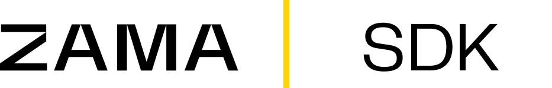

<p align="center">
<picture>
  <source media="(prefers-color-scheme: dark)" srcset="docs/gitbook/.gitbook/assets/SDK-header-dark.png">
  <source media="(prefers-color-scheme: light)" srcset="docs/gitbook/.gitbook/assets/SDK-header-light.png">
  
</picture>
</p>

<hr/>

<p align="center">
  <a href="https://docs.zama.org/protocol"> 📒 Documentation</a> | <a href="https://zama.ai/community"> 💛 Community support</a> | <a href="https://github.com/zama-ai/awesome-zama"> 📚 FHE resources by Zama</a>
</p>

<p align="center">
  <a href="https://www.npmjs.com/package/@zama-fhe/sdk">
    </a>
  <a href="https://www.npmjs.com/package/@zama-fhe/sdk">
    </a>
  <a href="https://github.com/zama-ai/sdk/blob/main/LICENSE">
    </a>
  <a href="https://github.com/zama-ai/bounty-program">
    </a>
</p>

<p align="center">
  <a href="https://www.npmjs.com/package/@zama-fhe/sdk">
    </a>
  <a href="https://www.npmjs.com/package/@zama-fhe/sdk">
    </a>
  <a href="https://github.com/zama-ai/sdk/actions/workflows/vitest.yml">
    </a>
  <a href="https://github.com/zama-ai/sdk/actions/workflows/playwright.yml">
    </a>
</p>

## About

### What is Zama SDK?

**Zama SDK** is a suite of TypeScript libraries for building privacy-preserving dApps on EVM-compatible blockchains powered by the _Zama Confidential Blockchain Protocol_. It provides everything you need to interact with confidential smart contracts using [Fully Homomorphic Encryption (FHE)](https://docs.zama.org/protocol/protocol/overview) — from encrypting inputs and decrypting results to managing access control — all from familiar TypeScript and React environments.

Zama SDK is designed for developers who want to integrate confidential operations into their applications without learning cryptography:

- **End-to-end encryption:** Transaction data and on-chain state remain encrypted at all times.
- **Framework-agnostic core:** Works with viem, ethers, or any EVM library.
- **React-ready:** First-class React hooks powered by `@tanstack/react-query`.

### Table of contents

- [About](#about)
  - [What is Zama SDK?](#what-is-zama-sdk)
  - [Table of contents](#table-of-contents)
  - [Packages](#packages)
  - [Main features](#main-features)
- [Working with Zama SDK](#working-with-zama-sdk)
  - [Install](#install)
  - [Development](#development)
  - [Claude Code Setup](#claude-code-setup)
  - [Contributing](#contributing)
  - [License](#license)
- [Resources](#resources)
- [Support](#support)

### Packages

| Package                                        | Description                                                                                                                 |
| ---------------------------------------------- | --------------------------------------------------------------------------------------------------------------------------- |
| [`@zama-fhe/sdk`](./packages/sdk/)             | Core SDK — confidential contract operations, FHE relayer, contract call builders, viem/ethers adapters, Node.js worker pool |
| [`@zama-fhe/react-sdk`](./packages/react-sdk/) | React hooks wrapping the core SDK via `@tanstack/react-query`, with viem/ethers/wagmi sub-paths                             |

### Main features

- **TypeScript-first:** Fully typed APIs with tree-shakeable ESM builds for minimal bundle size.
- **Privacy by design:** Encrypt inputs, decrypt outputs, and manage access control for confidential smart contracts.
- **Multi-library support:** Adapters for both viem and ethers, so you can use whichever EVM library your project already depends on.
- **React hooks:** Dedicated React package with hooks for encrypting, decrypting, reencrypting, and querying confidential state — all backed by `@tanstack/react-query` for caching and suspense.
- **Node.js worker pool:** Offload heavy FHE operations to a worker pool in server-side environments for non-blocking performance.
- **Wagmi integration:** Drop-in wagmi connector support for seamless wallet and provider management in React apps.

<p align="right">
  <a href="#about" > ↑ Back to top </a>
</p>

## Working with Zama SDK

### Install

```bash
# Core SDK (vanilla TypeScript)
pnpm add @zama-fhe/sdk
# or: npm install @zama-fhe/sdk / yarn add @zama-fhe/sdk

# React hooks
pnpm add @zama-fhe/react-sdk @tanstack/react-query
# or: npm install @zama-fhe/react-sdk @tanstack/react-query / yarn add @zama-fhe/react-sdk @tanstack/react-query
```

### Development

**Prerequisites:** Node.js >= 22, pnpm >= 10

```bash
pnpm install                # Install dependencies
pnpm build                  # Build all (sdk first, then react-sdk)
pnpm test                   # Watch mode
pnpm test:run               # Single run
pnpm typecheck              # Type checking
pnpm lint                   # Linting
pnpm format:check           # Formatting check
```

**E2E tests:**

```bash
pnpm submodule:init         # Initialize hardhat submodule (first time)
pnpm hardhat:install        # Install hardhat dependencies
pnpm e2e:test               # Run E2E tests (auto-starts hardhat + next dev)
pnpm e2e:test:ui            # Playwright UI mode
```

See [CONTRIBUTING.md](./CONTRIBUTING.md) for the full contributor guide (branching, PRs, code style, architecture).

### Claude Code Setup

This repository includes an opt-in [Claude Code](https://docs.anthropic.com/en/docs/claude-code) configuration in `claude-setup/settings.json`. It provides:

- **Auto-allowed commands** — `pnpm build`, `pnpm test`, `pnpm lint`, `pnpm typecheck`, `pnpm format`, and git diff variants run without prompting.
- **Denied reads** — `.env` files and `.next/` are blocked to prevent accidental secret exposure.
- **Ask-before-running** — destructive commands (`rm`), remote pushes (`git push`), and release commands require explicit approval.
- **Post-edit hooks** — every file write/edit automatically triggers `pnpm typecheck`, `pnpm lint`, and `pnpm format`.
- **Custom skills** — custom skills required for good development practices to contribute to this repo.

To use it, install [Claude Code](https://docs.anthropic.com/en/docs/claude-code) and run `pnpm setup:claude`.

### Contributing

There are two ways to contribute to Zama SDK:

- [Open issues](https://github.com/zama-ai/sdk/issues/new/choose) to report bugs and typos, or to suggest new ideas
- Request to become an official contributor by emailing hello@zama.ai.

Becoming an approved contributor involves signing our Contributor License Agreement (CLA). Only approved contributors can send pull requests, so please make sure to get in touch before you do!

### License

This software is distributed under the **BSD-3-Clause-Clear** license. Read [this](LICENSE) for more details.

## Resources

- [Documentation](https://docs.zama.org/protocol) — Official documentation of the Zama Confidential Blockchain Protocol.
- [Awesome Zama – FHEVM](https://github.com/zama-ai/awesome-zama?tab=readme-ov-file#fhevm) — Curated articles, talks, and ecosystem projects.

<p align="right">
  <a href="#about" > ↑ Back to top </a>
</p>

## Support

🌟 If you find this project helpful or interesting, please consider giving it a star on GitHub! Your support helps to grow the community and motivates further development.

<a target="_blank" href="https://community.zama.ai">
  💛 Community forum on Discourse
</a>

<p align="right">
  <a href="#about" > ↑ Back to top </a>
</p>
