# Encryption Architecture

This document maps every cryptographic operation in the Zama SDK — from credential storage to on-chain FHE operations.

## Overview

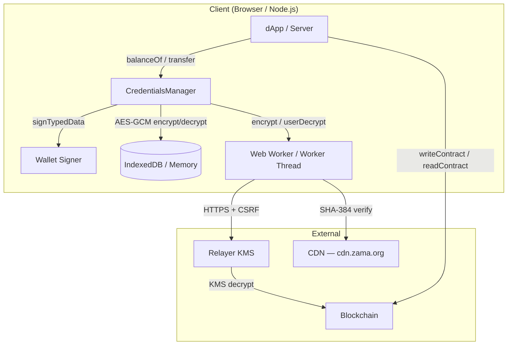

## 1. Credential Encryption at Rest

The FHE private key is encrypted with AES-GCM before storage. The encryption key is derived from the wallet's EIP-712 signature via PBKDF2. The signature itself is **never persisted** — it lives only in the in-memory session map.

### Key Derivation

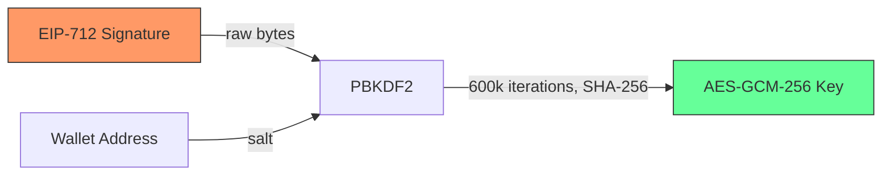

| Parameter   | Value                    |
| ----------- | ------------------------ |
| KDF         | PBKDF2                   |
| Hash        | SHA-256                  |
| Iterations  | 600,000                  |
| Salt        | Lowercase wallet address |
| Key length  | 256-bit                  |
| Extractable | `false`                  |

### Encrypt / Decrypt Flow

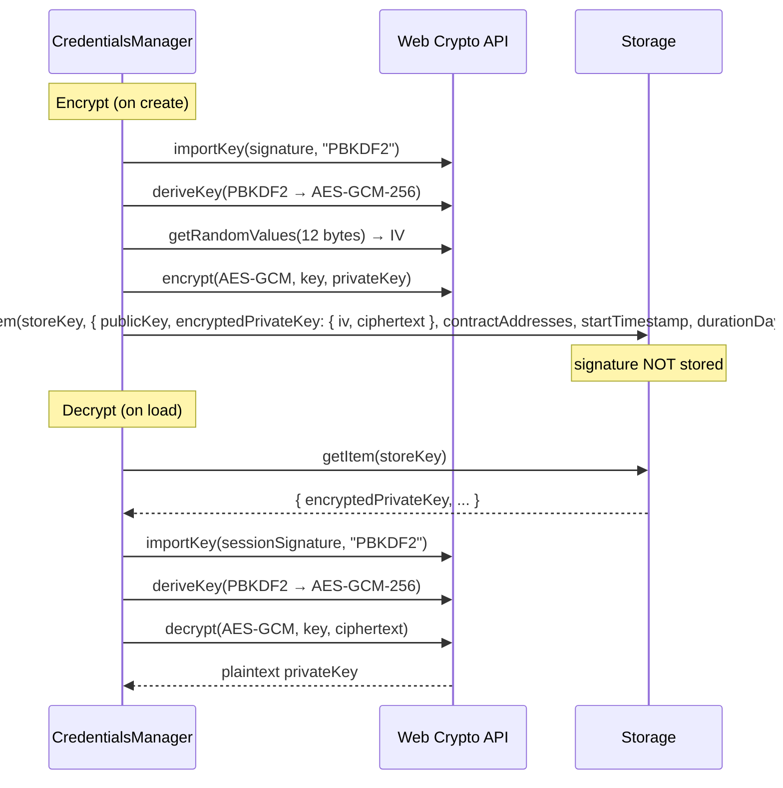

### What Gets Stored vs. What Stays in Memory

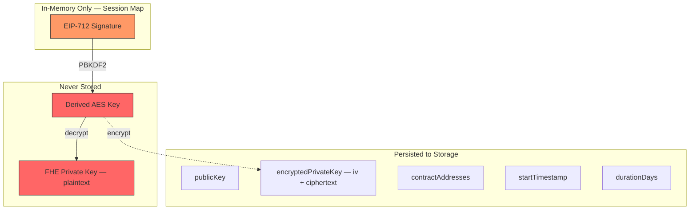

## 2. Session Signature Lifecycle

The signature lives in a `#sessionSignatures` Map (JS private field) keyed by a truncated SHA-256 hash of the wallet address.

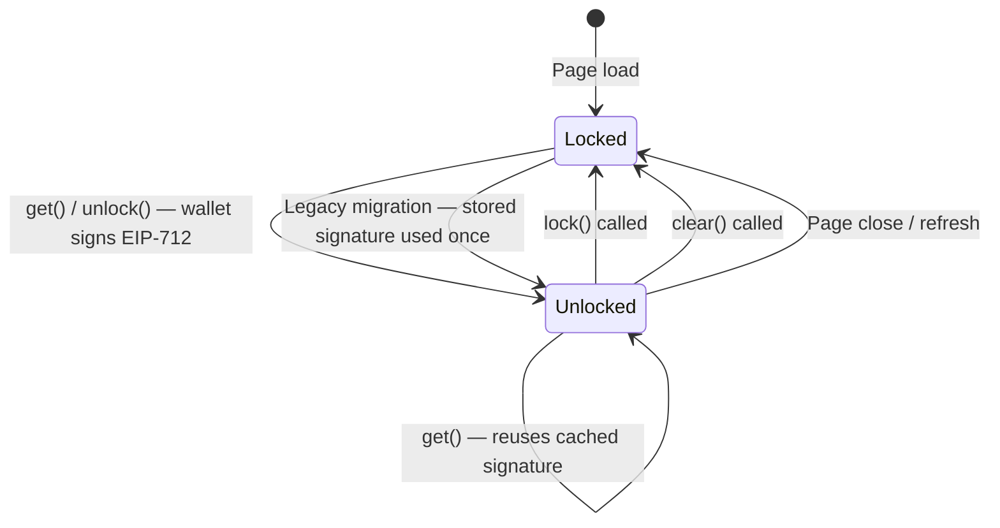

### Re-Sign Flow (New Session, Existing Credentials)

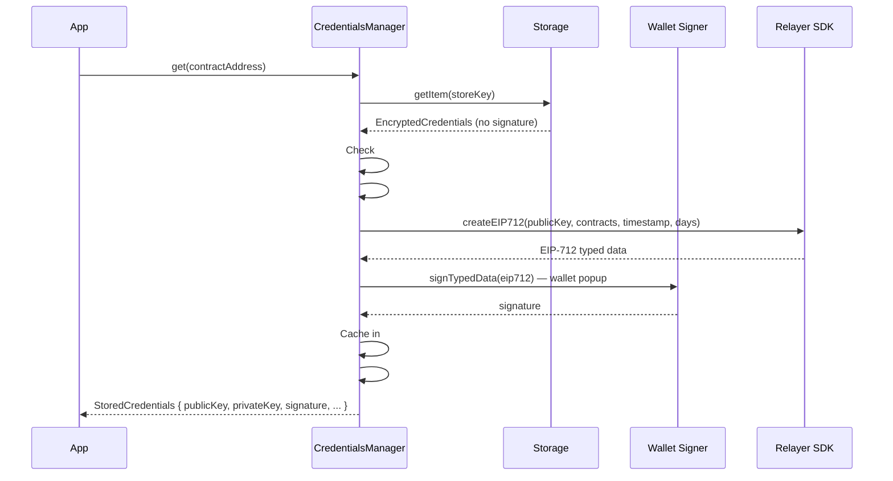

### Legacy Migration (One-Time)

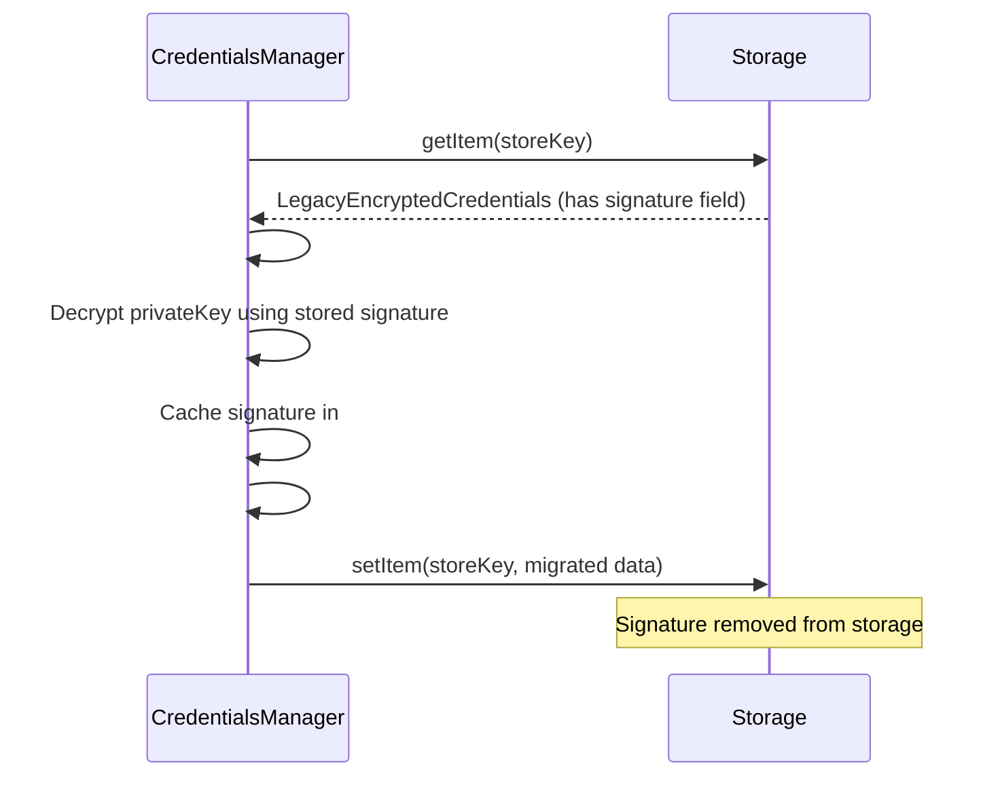

## 3. Store Key Hashing

Wallet addresses are hashed before use as storage keys so the storage backend never sees the raw address.

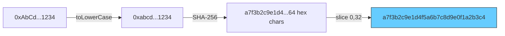

## 4. FHE Encryption (Shielding Values)

When a user shields, transfers, or unwraps tokens, plaintext bigint values are FHE-encrypted client-side via WASM before submission to the blockchain.

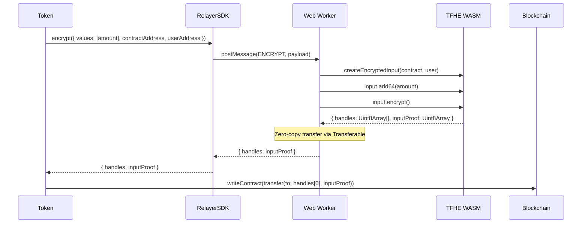

The `inputProof` is a ZK proof (generated inside the WASM) attesting the encrypted input is well-formed. It is verified on-chain by the `InputVerifier` contract.

## 5. FHE User Decrypt (Reading Balances)

To read an encrypted balance, the SDK sends FHE credentials to the relayer KMS, which re-encrypts the on-chain ciphertext under the user's FHE public key. The WASM client then decrypts locally with the private key.

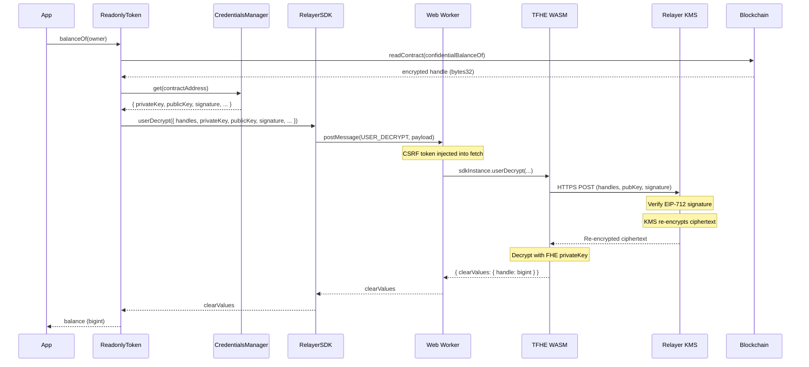

## 6. FHE Public Decrypt (Finalize Unwrap)

Public decryption requires no user credentials. The KMS decrypts and returns a proof that can be verified on-chain.

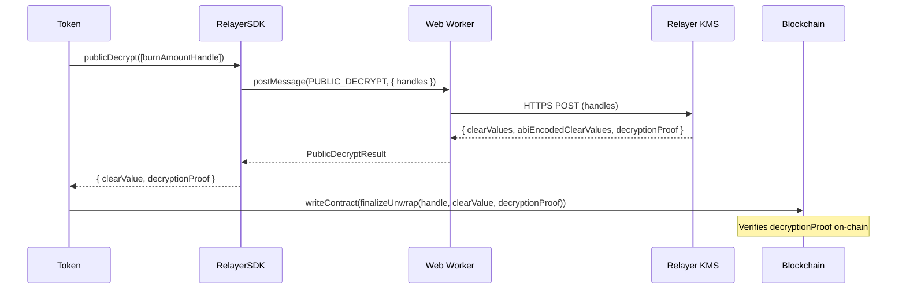

## 7. CDN Bundle Integrity (SHA-384)

The browser worker loads the TFHE WASM SDK from a CDN. The bundle is verified with a pinned SHA-384 hash before execution.

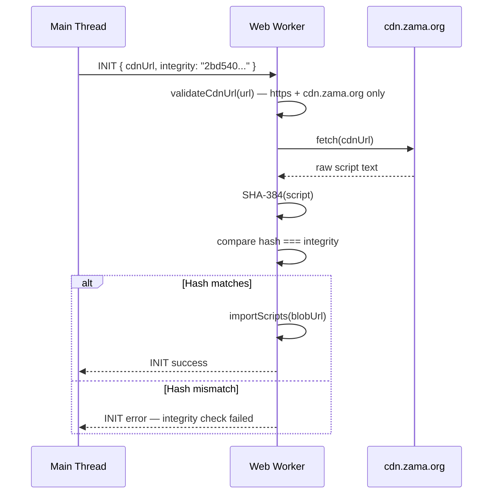

## 8. CSRF Protection

All mutating HTTP requests to the relayer proxy are protected with a CSRF token. The token is refreshed before every operation.

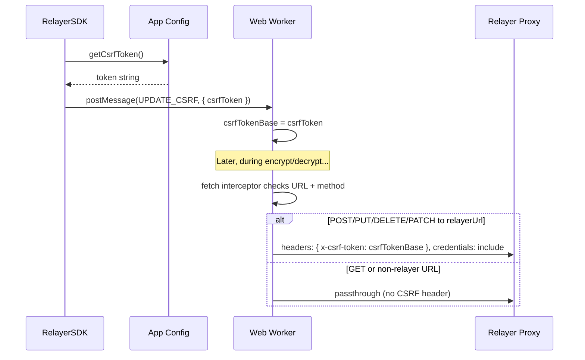

## 9. Worker Message Protocol

All cryptographic operations run off the main thread via a typed message-passing protocol with UUID-tracked request/response pairs.

```mermaid
graph TB
    subgraph "Main Thread"
        RC[RelayerWeb / RelayerNode]
        WC[WorkerClient — BaseWorkerClient]
    end

    subgraph "Worker Thread"
        WH[Message Handler — onmessage]
        WASM[TFHE WASM SDK]
    end

    RC -->|method call| WC
    WC -->|postMessage — { id: UUID, type, payload }| WH
    WH -->|delegates to| WASM
    WASM -->|result| WH
    WH -->|postMessage — { id, success, data }| WC
    WC -->|resolve promise| RC

    style WC fill:#6cf,stroke:#333
    style WH fill:#6cf,stroke:#333
```

### Message Types and Sensitive Data

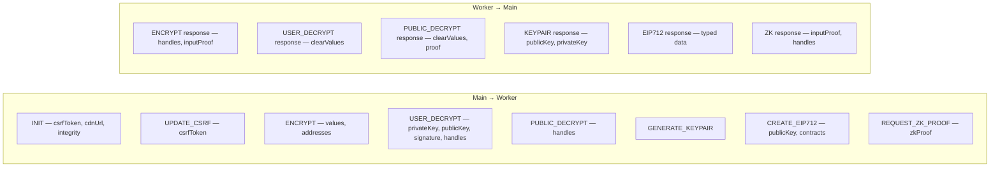

**Note:** `privateKey` and `signature` cross the postMessage boundary in plaintext as hex strings. This is safe because:

- Web Workers run in the same origin (same-process structured clone)
- Worker threads in Node.js use `worker_threads` (same-process message channel)
- Neither path involves network transmission

## 10. End-to-End: Shield → Transfer → Unshield

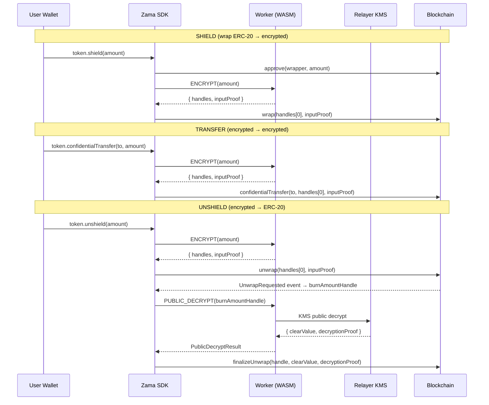

## Cryptographic Algorithms Summary

| Operation             | Algorithm           | Key Size        | Source                         |
| --------------------- | ------------------- | --------------- | ------------------------------ |
| Credential encryption | AES-GCM             | 256-bit         | Web Crypto API                 |
| Key derivation        | PBKDF2-SHA-256      | 600k iterations | Web Crypto API                 |
| Store key hashing     | SHA-256 (truncated) | 128-bit output  | Web Crypto API                 |
| CDN integrity         | SHA-384             | —               | Web Crypto API                 |
| FHE encryption        | TFHE                | Network key     | WASM (`@zama-fhe/relayer-sdk`) |
| ZK proofs             | WASM prover         | —               | WASM (`@zama-fhe/relayer-sdk`) |
| Wallet signing        | ECDSA secp256k1     | 256-bit         | User wallet                    |
| Request IDs           | UUID v4             | 128-bit         | `crypto.randomUUID()`          |
| CSRF tokens           | Opaque              | —               | App-provided callback          |
