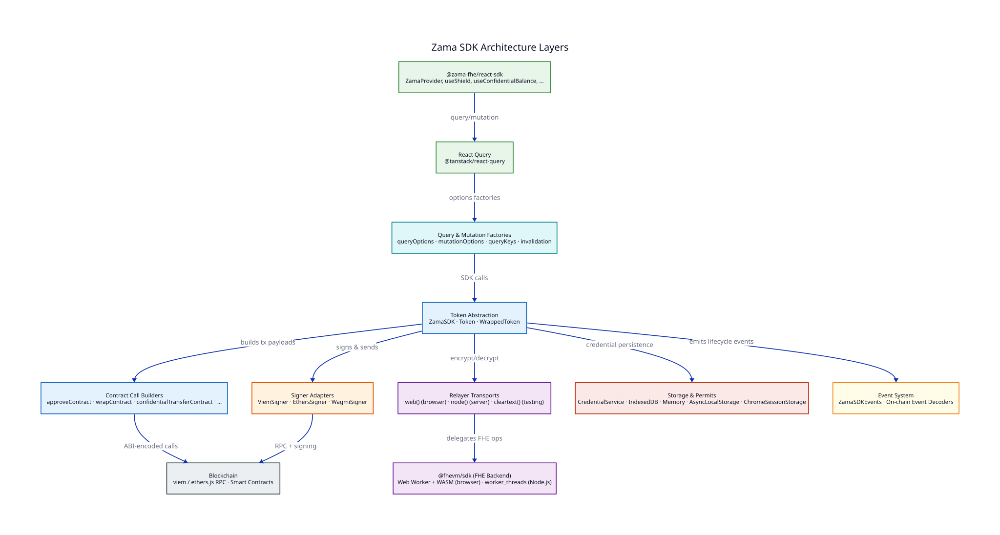
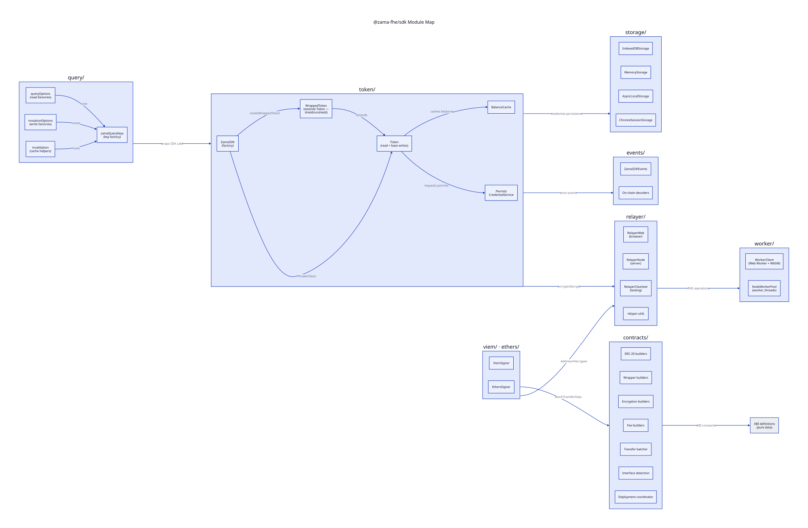

# Architecture

## Layer overview

The SDK is organized into layers, each with a clear responsibility. Higher layers depend on lower layers but never the reverse.

| Layer                          | Responsibility                                                                                                                             |
| ------------------------------ | ------------------------------------------------------------------------------------------------------------------------------------------ |
| **React SDK**                  | `ZamaProvider` context + hooks wrapping `@tanstack/react-query`                                                                            |
| **Query & Mutation Factories** | Framework-agnostic `queryOptions` / `mutationOptions` consumed by React Query (or directly)                                                |
| **Contract Abstraction**       | `ZamaSDK`, `Token`, `WrappedToken` — the main developer-facing API                                                                         |
| **Contract Call Builders**     | Pure functions returning `{ address, abi, functionName, args }` for any Web3 library                                                       |
| **Provider & Signer Adapters** | `ViemProvider`/`ViemSigner`, `EthersProvider`/`EthersSigner` — read/write split per library                                                |
| **Relayer**                    | `web()` (browser WASM), `node()` (server), `cleartext()` (cleartext chains) — selected by factory, routed per chain by `RelayerDispatcher` |
| **Worker**                     | Web Worker + WASM in browsers, `worker_threads` pool in Node.js                                                                            |
| **Storage & Credentials**      | `TransportKeyPairVault` + `PermissionStore` with pluggable backends (IndexedDB, Memory, AsyncLocalStorage)                                 |
| **Event System**               | `ZamaSDKEvents` lifecycle events + on-chain event decoders                                                                                 |

## `createConfig` pattern

Each SDK adapter path (`@zama-fhe/sdk/viem`, `@zama-fhe/sdk/ethers`) exports a `createConfig()` function that wires up the provider, signer, and relayer dispatcher from framework-native objects. For wagmi apps, `createConfig` from `@zama-fhe/react-sdk/wagmi` builds a `ZamaConfig` from your wagmi config; pass the result to `<ZamaProvider config={zamaConfig}>`.

## Module map

The core `@zama-fhe/sdk` package is split into focused modules:

### Entry points

Each package exposes multiple entry points for tree-shaking:

**`@zama-fhe/sdk`**

| Import Path               | Contents                                                                                               |
| ------------------------- | ------------------------------------------------------------------------------------------------------ |
| `@zama-fhe/sdk`           | Core SDK, `createConfig`, `cleartext()` factory, storage, ABIs, event decoders, contract call builders |
| `@zama-fhe/sdk/viem`      | `ViemProvider`, `ViemSigner` adapters + viem `createConfig`                                            |
| `@zama-fhe/sdk/ethers`    | `EthersProvider`, `EthersSigner` adapters + ethers `createConfig`                                      |
| `@zama-fhe/sdk/web`       | `web()` transport factory                                                                              |
| `@zama-fhe/sdk/cleartext` | `cleartext()` transport factory (also re-exported from the root)                                       |
| `@zama-fhe/sdk/node`      | `node()` transport factory, network presets, type-only exports                                         |
| `@zama-fhe/sdk/query`     | Query/mutation option factories, query keys, invalidation helpers                                      |

**`@zama-fhe/react-sdk`**

| Import Path                 | Contents                                                   |
| --------------------------- | ---------------------------------------------------------- |
| `@zama-fhe/react-sdk`       | Provider-based hooks (`ZamaProvider` + `use*` hooks)       |
| `@zama-fhe/react-sdk/wagmi` | `createConfig` — builds a `ZamaConfig` from a wagmi config |
