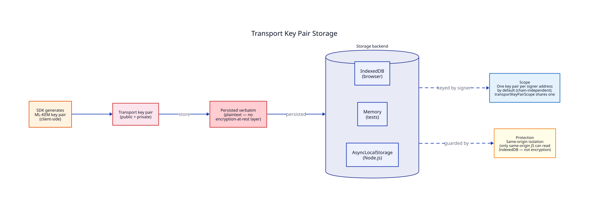
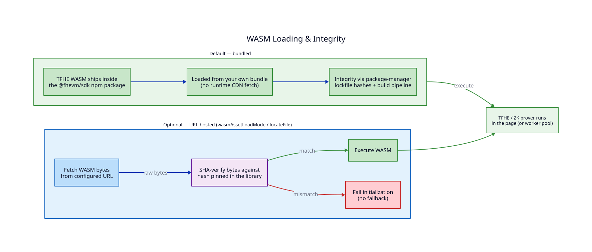

# Security model

This page describes what the SDK protects, what it exposes, and the trust assumptions underlying its design. Understanding these boundaries helps you make informed decisions about deploying confidential tokens.

## What is encrypted

Confidential tokens encrypt **balances** and **confidential transfer amounts**. When a user transfers 500 tokens privately, the plaintext amount is FHE-encrypted client-side before the transaction reaches the blockchain, and the on-chain contract only ever sees the ciphertext.

Shielding and unshielding are the public boundary: they convert tokens between a public ERC-20 and its confidential form, so the **shield/unshield amount is visible on-chain** — it is an ordinary public ERC-20 movement. Privacy begins once tokens are in confidential form: the resulting balance is encrypted, and later confidential transfers hide their amounts.

The on-chain contract stores FHE ciphertexts instead of `uint256` values. Only the balance owner (via their FHE private key and the relayer KMS) can decrypt their own balance.

## What is visible

FHE protects values, not metadata. The following remain publicly observable on-chain:

- **Transaction existence** — that a transaction occurred is visible in the block.
- **Participant addresses** — sender and receiver addresses are part of the transaction.
- **Token contract address** — which confidential token is involved.
- **Transaction type** — whether the call is a shield, transfer, unshield, or approval.
- **Shield and unshield amounts** — converting between public ERC-20 and confidential form is a public ERC-20 transfer, so the converted amount is visible. Only confidential transfers hide their amounts.
- **Gas costs** — standard Ethereum gas accounting.
- **Timing** — when transactions occur.

An observer can see that address A sent a confidential transfer to address B on token contract C. They cannot see how much was sent.


This is a value-privacy model, not a full-privacy model. It protects amounts while preserving the public verifiability that makes Ethereum useful. For transaction-graph privacy, additional measures (like mixing services or stealth addresses) would be needed on top of FHE.


## Trust assumptions

### The relayer and KMS

The relayer provides the FHE infrastructure: encryption, decryption coordination, and transport key pair generation. The Key Management Service (KMS) holds the network's FHE master key and performs re-encryption.

The critical trust property: **the KMS re-encrypts ciphertexts without learning plaintext values.** When a user requests their balance, the KMS transforms the on-chain ciphertext from the network key to the user's public key. The KMS sees ciphertexts in and ciphertexts out — never plaintext.

This is a cryptographic property of the re-encryption scheme, not a policy promise. The KMS cannot extract plaintext from the ciphertexts it processes, assuming the underlying TFHE scheme is secure.


The KMS must be available for decryption to work. If the relayer is down, users cannot read their balances or finalize unshield operations. The on-chain encrypted data remains safe — it is inaccessible without the FHE infrastructure, but also unreadable until the relayer returns.


### The blockchain

The on-chain FHE coprocessor (FHEVM) executes homomorphic operations. It must correctly perform encrypted arithmetic for transfers and balance updates. This is part of the blockchain's consensus — nodes verify FHE operations as part of block validation.

### The user's wallet

The wallet signs EIP-712 typed data to authorize FHE operations. The SDK trusts that the wallet correctly implements `eth_signTypedData_v4` and that the signing key is under the user's control. A compromised wallet compromises the FHE session — the attacker could sign authorization requests and decrypt the user's balances.

## Credential storage

### Transport key pair storage

By default, the transport private key is stored in plaintext in the configured storage backend (typically IndexedDB in browsers) — no encryption-at-rest layer. This is correct for most contexts: browser dApps have IndexedDB behind OS-level disk encryption, mobile apps have platform keychains, server operators typically have a KMS/Vault/HSM in front of their storage. See [Wrapped at rest](#wrapped-at-rest-derivationsecret) below for the opt-in alternative when none of that exists.



| Parameter  | Value                                                                    |
| ---------- | ------------------------------------------------------------------------ |
| Storage    | IndexedDB (browser), memory (tests), AsyncLocalStorage (Node.js)         |
| Key format | Plaintext ML-KEM key pair by default — see below for wrapped             |
| Scope      | One transport key pair per signer address by default (chain-independent) |

The security model relies on same-origin isolation: only JavaScript running on the same origin can read IndexedDB. See [Permit Model](./permit-model.md) for the full lifecycle.

### Wrapped at rest (`derivationSecret`)

The gap in the default model above is **headless contexts** — CLI tools, agentic operators on bare metal, local dev environments — where no platform keystore exists and no operator KMS sits in front of storage. There's nothing to delegate security to.

`derivationSecret` (`string | Uint8Array`) closes that gap by wrapping the private key half before every write and unwrapping it after every read, transparently, inside the credential store. The SDK never manages or stores this value — it comes from your environment (an env var from a secrets manager, a mounted file, a KMS-unwrapped blob) and exists only for the lifetime of your process. It must carry real entropy: the SDK rejects anything under 256 bits (matching the AES-256 key it feeds), but a length check can't verify actual randomness, so source it from a CSPRNG or secrets manager, never a human-memorable passphrase — HKDF does no key-stretching, so the secret's raw entropy is the only thing standing between a storage-reading attacker and the private key.

```
wrappingKey = HKDF-SHA256(ikm: derivationSecret, salt: identity, info: "zama-sdk-keypair-wrapping-v1")
ciphertext  = AES-256-GCM(wrappingKey, random 96-bit IV, privateKey, aad: publicKey + createdAt + expiresAt)
```

`identity` is the same value used for storage keying (see [Shared-tenant scope](#shared-tenant-scope-b2b2c-waas-operators) below) — the configured `transportKeyPairScope` if set, else the signer address — so a scope's signers derive one shared wrapping key, not one each. Only the private key half is wrapped; the public key and timestamps stay in plaintext alongside the ciphertext, but bound to it as AES-GCM additional authenticated data, so a storage-level attacker can't tamper with them (e.g. mismatching the public key, or extending `expiresAt`) without also failing decryption. Every permit stays in plaintext, unauthenticated by this scheme — permits are already public data (an EIP-712 signature and a list of contract addresses).

| Storage mode                            | Config             | Storage needed? | Secure storage needed?    |
| --------------------------------------- | ------------------ | --------------- | ------------------------- |
| Plaintext, delegated security (default) | —                  | Yes             | Yes (your responsibility) |
| Wrapped at rest                         | `derivationSecret` | Yes             | No — any key-value store  |


This doesn't eliminate storage — the (now wrapped) key pair is still persisted. It eliminates the requirement for storage to be _secure_.



**Two ways to defeat this — don't.** `derivationSecret` only helps if it's genuinely out-of-band from the storage it protects.

- **Don't source `derivationSecret` from the same store it wraps.** Reading the secret from the same (untrusted) storage that holds the wrapped key pair puts the lock and key in the same drawer — an attacker who can read one can read both, and the wrapping buys you nothing. The secret has to come from somewhere that storage-level attacker can't reach: a secrets manager, a KMS-unwrapped blob, an injected env var.
- **Don't wrap storage that's already secure.** If you're already on a platform keychain, a KMS-backed store, or any at-rest-encrypted backend, `derivationSecret` is redundant — you'd be double-wrapping, adding a key-management burden (rotation, distribution, loss) without adding security. It exists for the [headless-context gap](#wrapped-at-rest-derivationsecret) above, not as a default to layer on everything.



**Rotation is just changing the value — for a per-signer key pair.** `derivationSecret` is set once at `ZamaSDK` construction, like every other credentials option — there's no live "update config" call. Changing it (or losing it) doesn't corrupt anything: the next read fails to authenticate against the stored ciphertext, is treated exactly like a cache miss (deleted, not surfaced as an error), and the next `grantPermit()` regenerates a fresh key pair and re-persists it wrapped with the new secret. One extra wallet re-prompt, never a crash.


This self-healing behavior only applies when `transportKeyPairScope` is **not** set. Combined with a shared scope, every instance sharing that scope must use the _same_ `derivationSecret` at all times. A misconfigured instance never gets to overwrite (and thereby invalidate, for every signer in the scope) a peer's entry: reading a scope's shared entry throws instead of silently regenerating in all three mismatch shapes — the wrong secret, a wrapped entry read by an instance with no secret configured, and a plaintext entry read by an instance that has one. Roll `derivationSecret` out to every instance sharing a scope before the first wrapped write, or expect this error during the transition window. To migrate a scope that is already live, configure the same secret everywhere first, then call `sdk.permits.revokeTransportKeyPair(scopeId)` once to drop the old entry so the next access regenerates it under the new configuration.


### Shared-tenant scope (B2B2C / WaaS operators)

`transportKeyPairScope` is an opt-in escape hatch from the per-signer default. When configured, every signer that shares the same scope identifier reads and writes the _same_ transport key pair instead of generating one per signer address.

**When it's the right tradeoff.** A separately-tenanted deployment (browser or mobile dApp, treasury wallet) gets real defense-in-depth from per-signer keys: compromising one signer's storage never exposes another user's key. A shared-tenant Wallet-as-a-Service operator holding thousands of client wallets behind one operator-controlled key store gets none of that benefit — if the store is breached, every wallet behind it is compromised together regardless of how many key pairs exist. In that case, per-signer keys are pure overhead (generation, storage rows, management) with no corresponding security gain, and `transportKeyPairScope` lets the operator collapse them into one.

**When it isn't.** If signers are genuinely isolated — separate end-user devices, separate trust boundaries, separate storage backends — per-signer keys (the default) give you isolation that a shared scope would throw away. Don't configure a scope just to save storage rows if your signers don't already share one key store.

**What stays isolated regardless of scope.** Permits are always per-signer: the EIP-712 signature is inherently tied to the signing wallet, so two signers in the same scope never see each other's permits, only the underlying key pair. See [Permit Model](./permit-model.md#revocation) for how revocation is split into two tiers to preserve this isolation.


Sharing only works if every signer in the scope reads and writes the **same** storage instance. `asyncLocalStorage` — the storage recommended for [Node.js servers](../guides/configuration.md#6-optional-choose-a-storage-backend) — isolates a fresh, empty store per request by design, which defeats sharing entirely: each request would regenerate the "shared" key pair and lose it immediately after. WaaS operators need one persistent `GenericStorage` (e.g. a database- or Redis-backed adapter) wired into every `ZamaSDK` instance that shares a scope.


**Onboarding race.** `GenericStorage` has no compare-and-swap, so the very first time a scope's key pair is created, concurrent signers can race the underlying storage. This isn't just a more-likely version of the ordinary per-signer race (two tabs for the same end-user, where the loser just re-signs) — under a shared scope the racers are typically _different_ end-users behind the same operator, so the losing side can have an already-granted permit silently pruned as stale through no action of its own, and because one slot serves the whole cohort, every TTL expiry or `revokeTransportKeyPair()` call is a correlated event that can push many signers into the window at once. Pre-warm a scope's key pair once with `sdk.permits.warmTransportKeyPairScope(scopeId)` before opening concurrent traffic to it, rather than letting the first wave of real users race each other.


Use `sdk.permits.warmTransportKeyPairScope(scopeId)`, not `sdk.permits.warmTransportKeyPair()`, to pre-warm a scope. The latter is gated on a connected wallet-account snapshot — a precondition inherited from its per-signer use case that doesn't apply to a scope-wide key, and it would silently no-op precisely when an operator is most likely to call it: before any end-user is connected. `warmTransportKeyPairScope()` needs no wallet account _connected_ — though, like the rest of the `credentials/` facade, it still requires a `signer` to be configured on the `ZamaSDK` instance at construction time — matching `revokeTransportKeyPair()`'s operator-level design.


### Limitations

<details>
<summary>What same-origin isolation does NOT protect against</summary>

- **Same-origin scripts** — any JavaScript running on the same origin can read IndexedDB. A cross-site scripting (XSS) vulnerability could access the transport private key directly. Reducing XSS surface is essential.
- **Physical device access** — someone with access to the device's file system can read the IndexedDB contents.
- **Malicious browser extensions** — extensions with broad permissions can access IndexedDB. Users should audit their installed extensions.

</details>

## WASM bundle integrity

The TFHE WASM binaries ship **inside the `@fhevm/sdk` npm package** and load from your own bundle — there is no runtime CDN fetch. Integrity is guaranteed the same way as any other dependency: by your package manager's lockfile hashes and your build pipeline.

For advanced deployments that host the WASM assets on a URL instead (via the `runtime` option's `wasmAssetLoadMode` / `locateFile`), the integrity guarantee depends on the mode: `verified-blob` SHA-verifies the fetched bytes against hashes pinned in the library and fails initialization on mismatch, `precheck-direct-url` runs a precheck request before loading directly from the URL, and `trusted-direct-url` loads directly with no verification (fastest, least defensive). The `embedded-base64` mode inlines the WASM as base64 with no network fetch at all. See the [`wasmAssetLoadMode` mode table](../changelog/alpha.md) for the full list.



## Browser security headers

### COOP/COEP headers

Multi-threaded FHE uses `SharedArrayBuffer`, which browsers restrict to cross-origin isolated contexts. To enable multi-threaded encryption, your server must send these headers:

```
Cross-Origin-Opener-Policy: same-origin
Cross-Origin-Embedder-Policy: require-corp
```

Without them, `SharedArrayBuffer` is unavailable and the SDK falls back to single-threaded WASM execution — slower, but fully functional. When this happens, `@fhevm/sdk` logs a console warning naming the two headers.


These headers are a performance setting, not a hard requirement. Encryption works without them in single-threaded mode. Only enable cross-origin isolation if you want the throughput of multi-threaded FHE.


### Content Security Policy (CSP)

The SDK compiles and executes the bundled WASM in the page, and — in multi-threaded mode — spawns its worker pool from embedded source. Your CSP must allow:

| Directive     | Value                | Reason                                                     |
| ------------- | -------------------- | ---------------------------------------------------------- |
| `script-src`  | `'wasm-unsafe-eval'` | Required for WASM compilation and execution                |
| `worker-src`  | `blob:`              | Multi-threaded mode creates its worker pool from blob URLs |
| `connect-src` | your relayer URL     | Encrypt/decrypt requests go to the relayer (or your proxy) |

Example CSP header:

```
Content-Security-Policy: worker-src blob:; script-src 'self' 'wasm-unsafe-eval'; connect-src 'self' https://relayer.testnet.zama.org https://your-relayer-proxy.com;
```

<details>
<summary>Why wasm-unsafe-eval?</summary>

The `wasm-unsafe-eval` directive allows WASM compilation and execution without requiring `unsafe-eval`. It is narrower than `unsafe-eval` — it permits only WebAssembly instantiation, not arbitrary JavaScript `eval()`. All major browsers support it as of 2024.

</details>

## Permit security

### Time-bounded signatures

EIP-712 permit signatures include a start timestamp and duration (in days). The relayer rejects permits outside their validity window. This limits the damage from a leaked permit — it becomes useless after expiry.

Two TTL controls are available:

- `transportKeyPairTTL` — how long the transport key pair remains valid (default: 30 days).
- `permitTTL` — how long signed permits remain valid, in days (default: 30).

### Address-scoped authorization

The EIP-712 typed data includes the wallet address. A permit signed by address A cannot authorize decryption for address B. Combined with contract-scoped authorization (the signed message lists specific contract addresses), each permit is tightly bound to a specific user and set of contracts.

### Revocation

Permits can be revoked programmatically via `sdk.permits.revokePermits()` or automatically via wallet lifecycle events (disconnect, account switch). Revocation removes permits from storage immediately.

After revoking permits, the transport key pair remains in storage. Use `sdk.permits.clear()` to also wipe the key pair.

**With a shared `transportKeyPairScope` configured, these signer-level operations never touch the shared key pair** — `sdk.permits.clear()` for one signer only ever removes that signer's own permits, exactly like `revokePermits()`. This is deliberate: one end-user disconnecting must never invalidate every other signer sharing the scope's operator-controlled key store.

Invalidating the shared key pair itself is a distinct, operator-level operation: `sdk.permits.revokeTransportKeyPair(scopeId)`. It deletes the scope's key pair; every permit in the scope embeds that key pair's public key, so they're all treated as stale on next access — no permit needs to be touched directly, and no wallet needs to be connected. Use it for suspected compromise, periodic rotation, or scope decommissioning — never as a side effect of a single signer's revoke.

`revokeTransportKeyPair()` only stops the SDK from reissuing or reusing the deleted key going forward — it does not revoke permits already issued under it. A permit is a self-contained, bearer-style EIP-712 signature the relayer accepts on its own terms; nothing in this SDK (or, from the client's perspective, on the relayer/KMS side) can push-revoke one server-side. If a compromise already exfiltrated both the shared private key and a still-valid permit — realistic, since permits and the key pair share the same `storage` by default unless `permitStorage` is configured separately — that permit remains usable against the relayer directly, bypassing this SDK entirely, until its own `permitTTL` expiry. `revokeTransportKeyPair()` closes the SDK-local half of the exposure; it is not a substitute for treating any already-issued permit from a compromised store as live until it naturally expires.

## CSRF protection

For browser apps, the `web()` transport supports CSRF tokens injected into all mutating HTTP requests to the relayer proxy:

```ts
const config = createConfig({
  chains: [sepolia],
  publicClient,
  walletClient,
  relayers: {
    [sepolia.id]: web({
      security: { getCsrfToken: () => document.cookie.match(/csrf=(\w+)/)?.[1] ?? "" },
    }),
  },
});
```

The token is refreshed before each encrypt/decrypt call. Only POST, PUT, DELETE, and PATCH requests to the relayer URL include the CSRF header. GET requests and non-relayer URLs pass through without modification.

## Summary of cryptographic algorithms

| Operation                       | Algorithm       | Key size    | Source                |
| ------------------------------- | --------------- | ----------- | --------------------- |
| WASM integrity (URL mode, opt.) | SHA-384         | --          | Web Crypto API        |
| FHE encryption                  | TFHE            | Network key | WASM (`@fhevm/sdk`)   |
| ZK proofs                       | WASM prover     | --          | WASM (`@fhevm/sdk`)   |
| Wallet signing                  | ECDSA secp256k1 | 256-bit     | User wallet           |
| Request tracking                | UUID v4         | 128-bit     | `crypto.randomUUID()` |

## Reporting vulnerabilities

If you discover a security vulnerability in the SDK, report it to **security@zama.ai**. Do not open a public GitHub issue for security reports. See the [Security Policy](https://github.com/zama-ai/sdk/blob/main/SECURITY.md) for full details.
