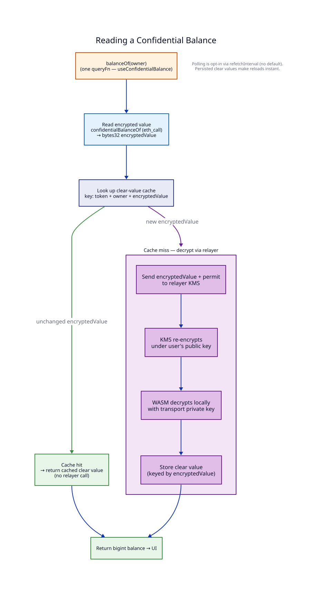
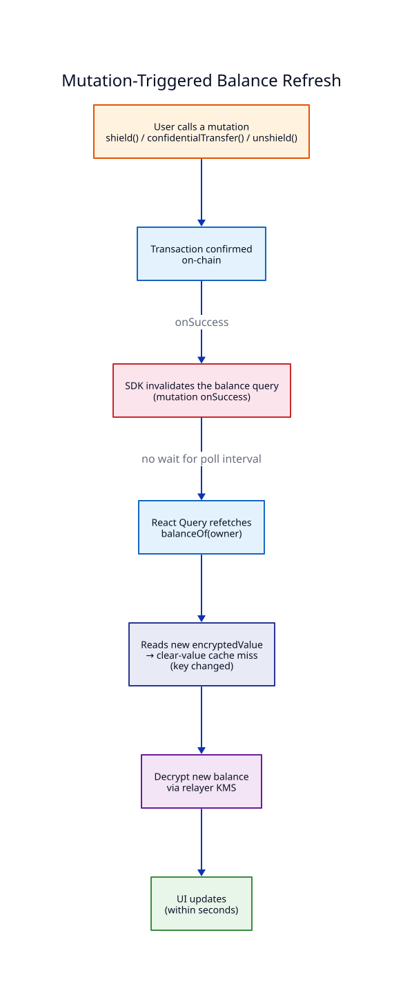

# Check balances

Confidential balances are stored on-chain as encrypted values. To display a human-readable number, the SDK decrypts them using FHE permits tied to the user's wallet. This guide walks through reading balances, understanding the caching layer, and working with multiple tokens.

## Steps

### 1. Read your own balance

Call `balanceOf()` on a [`Token`](../reference/sdk/Token.md) instance. The SDK fetches the encrypted value from the chain, decrypts it, and returns a `bigint`. In React, `useConfidentialBalance` wraps the same call with polling and caching.




```ts
import { createConfig } from "@zama-fhe/sdk/viem";
import { ZamaSDK } from "@zama-fhe/sdk";
import { web } from "@zama-fhe/sdk/web";
import { sepolia } from "@zama-fhe/sdk/chains";

const config = createConfig({
  chains: [sepolia],
  publicClient,
  walletClient,
  storage,
  relayers: { [sepolia.id]: web() },
});
const sdk = new ZamaSDK(config);
const token = sdk.createToken("0xEncryptedERC20");

const [address] = await walletClient.getAddresses();
const balance = await token.balanceOf(address);
console.log(`Confidential balance: ${balance}`);
```




```tsx
import { useConfidentialBalance, useHasPermit } from "@zama-fhe/react-sdk";
import { useAccount } from "wagmi";

const { address } = useAccount();

// Gate the read behind an existing permit so it never triggers a wallet signature on
// render (see step 2). Flip `enabled` on from an explicit "Decrypt" action once the
// user opts in.
const { data: hasPermit } = useHasPermit({ contractAddresses: ["0xEncryptedERC20"] });
const {
  data: balance,
  isLoading,
  error,
} = useConfidentialBalance(
  { address: "0xEncryptedERC20", account: address },
  { enabled: hasPermit },
);
```




### 2. Understand the first-time wallet signature

The first `balanceOf(address)` call for a token prompts the user's wallet for an EIP-712 signature. This creates FHE decrypt permits that are cached in your storage backend. Subsequent reads are silent -- no wallet popup.


**In React apps, don't trigger this signature on render.** Gate `useConfidentialBalance` behind `useHasPermit` and let the user click an explicit "Decrypt" button. See [Avoid blind-sign wallet popups](encrypt-decrypt.md#gating-useconfidentialbalance) for the full pattern.


If the user rejects the signature, the SDK throws a `SigningRejectedError`. See [Handle Errors](handle-errors.md) for recovery patterns.

You can pre-authorize multiple tokens up front with `grantPermit`. It signs in batches of up to 10 contracts — so a set of ≤10 is a single signature (larger sets prompt once per batch) — after which `balanceOf()` calls for those tokens are silent:




```ts
await sdk.permits.grantPermit(["0xTokenA", "0xTokenB"]);

const tokenA = sdk.createToken("0xTokenA");
const tokenB = sdk.createToken("0xTokenB");
// All subsequent balanceOf() calls are silent
```




```tsx
import { useGrantPermit } from "@zama-fhe/react-sdk";

const { mutate: grantPermit, isPending } = useGrantPermit();

// One wallet signature covers both tokens
grantPermit(["0xTokenA", "0xTokenB"]);
```




### 3. Balance caching

Decrypted balances are automatically cached in your storage backend (IndexedDB, async local storage, etc.). This means:

- **No spinner on page reload** -- if a balance was previously decrypted, it is returned instantly from cache instead of re-running the 2-5 second FHE decryption.
- **Automatic invalidation** -- the cache key includes the on-chain encrypted value, so when a transfer, shield, or unshield changes the balance, the old cache entry is naturally bypassed.
- **Best-effort** -- cache reads and writes never throw. If storage is unavailable, the SDK falls back to a fresh decryption silently.

The cache is keyed by `token address + owner address + encrypted value`.

A single `balanceOf()` call reads the on-chain encrypted value and decrypts it in one pass — the relayer is only hit when the encrypted value has changed since the last decryption:



### 4. Work with raw encrypted values

Sometimes you need the encrypted value itself, for example to check whether a balance exists before attempting decryption. This is a core-SDK concern — reach for `confidentialBalanceOf` and `decryptValues` directly:




```ts
import { isEncryptedValueZero } from "@zama-fhe/sdk";

const encryptedValue = await token.confidentialBalanceOf(userAddress);

// Check if the encrypted value is zero (account has never shielded)
if (isEncryptedValueZero(encryptedValue)) {
  console.log("No confidential balance yet");
}

// Decrypt an encrypted value you already have
const result = await sdk.decryption.decryptValues([
  { encryptedValue, contractAddress: token.address },
]);
const value = result[encryptedValue] as bigint;

// Decrypt multiple encrypted values at once (must include the contract address per entry)
const decrypted = await sdk.decryption.decryptValues(
  [value1, value2, value3].map((v) => ({ encryptedValue: v, contractAddress: token.address })),
);
```




### 5. Distinguish "no balance" from "zero balance"

These are different situations that your UI should handle separately:

- **`NoCiphertextError`** -- the account has never shielded tokens. There is no encrypted balance to decrypt. Show something like "No confidential balance" in your UI.
- **Balance of `0n`** -- the account has shielded before but currently holds zero. Show "Balance: 0".




```ts
import { NoCiphertextError } from "@zama-fhe/sdk";

try {
  const [address] = await walletClient.getAddresses();
  const balance = await token.balanceOf(address);
  showBalance(balance); // could be 0n
} catch (error) {
  if (error instanceof NoCiphertextError) {
    showEmptyState("Shield tokens to get started");
  }
}
```




```tsx
import { useConfidentialBalance } from "@zama-fhe/react-sdk";
import { NoCiphertextError } from "@zama-fhe/sdk";
import { useAccount } from "wagmi";

const { address } = useAccount();
const { data: balance, error } = useConfidentialBalance({ address: "0xToken", account: address });

if (error instanceof NoCiphertextError) return <EmptyState label="Shield tokens to get started" />;
// balance can still be 0n — render "Balance: 0" in that case
```




### 6. Batch decrypt across multiple tokens

When your app manages a portfolio of confidential tokens, use batch operations to minimize wallet prompts and parallelize decryption.




```ts
import { Token } from "@zama-fhe/sdk";

// One wallet signature covers all tokens
await sdk.permits.grantPermit(addresses);

const tokens = addresses.map((a) => sdk.createToken(a));

// Decrypt all balances in parallel
const { results, errors } = await Token.batchBalancesOf(tokens, userAddress);

// `results` is Map<Address, bigint> for tokens that decrypted successfully,
// `errors` is Map<Address, ZamaError> for tokens that failed. A failure that
// affects the whole session (rejected signature, RPC rate limit, revoked KMS
// context) rejects the call instead of filling `errors`.
for (const [address, balance] of results) {
  console.log(address, balance);
}
```




```tsx
import { useConfidentialBalances } from "@zama-fhe/react-sdk";
import { useAccount } from "wagmi";

const { address } = useAccount();
const { data } = useConfidentialBalances({
  addresses: ["0xTokenA", "0xTokenB", "0xTokenC"],
  account: address,
});

// data.results is Map<Address, bigint>; data.errors is Map<Address, ZamaError>
const tokenABalance = data?.results.get("0xTokenA");
```




### 7. Read token metadata

Before displaying balances, you typically want the token's name, symbol, and decimals.




```ts
const [name, symbol, decimals] = await Promise.all([
  token.name(),
  token.symbol(),
  token.decimals(),
]);
```




```tsx
import { useMetadata } from "@zama-fhe/react-sdk";

const { data: meta } = useMetadata("0xToken");

// meta.name, meta.symbol, meta.decimals
```




See the [useMetadata reference](../reference/react/useMetadata.md) for full options.

### 8. (React) Poll for balance updates

`useConfidentialBalance` (step 1) and `useConfidentialBalances` (step 6) integrate with React Query out of the box. Pass `refetchInterval` to either to poll on a timer:

```tsx
const { data: balance } = useConfidentialBalance(
  { address: "0xToken", account: address },
  { refetchInterval: 5_000 },
);
```

Under the hood, `useConfidentialBalance` calls `token.balanceOf(owner)` — reading the on-chain encrypted value and decrypting via the SDK. Cached clear values are served instantly; the relayer is only hit when the encrypted value changes, and clear values are persisted in storage so page reloads show the balance without a spinner.

### 9. (React) Force a manual refresh

Mutations automatically invalidate balance caches, so the balance refreshes on its own after a shield, transfer, or unshield:



But if you need manual control (for example, after an external contract interaction), use `zamaQueryKeys`:

```tsx
import { useQueryClient } from "@tanstack/react-query";
import { invalidateBalanceQueries } from "@zama-fhe/sdk/query";

const queryClient = useQueryClient();

// Refresh a token's balance. `invalidateBalanceQueries` is the same helper the SDK's
// own mutations use — it invalidates both the single-token (`confidentialBalance`) and
// batched (`confidentialBalances`) caches, which are disjoint namespaces. Hand-composing
// `zamaQueryKeys.confidentialBalance.*` keys only hits one and silently leaves the other stale.
invalidateBalanceQueries(queryClient, "0xToken");
```

See the [query keys reference](../reference/react/query-keys.md#invalidatebalancequeries) for the raw key factories when you need finer targeting.

## Next steps

- See [Avoid blind-sign wallet popups](encrypt-decrypt.md#gating-useconfidentialbalance) to gate balance queries behind explicit user action.
- See [Token Operations](../reference/sdk/Token.md) for the full `Token` API.
- See [Hooks](../reference/react/query-keys.md) for `useConfidentialBalance`, `useConfidentialBalances`, and query key details.
- To handle `NoCiphertextError` and other failures, see [Handle Errors](handle-errors.md).
