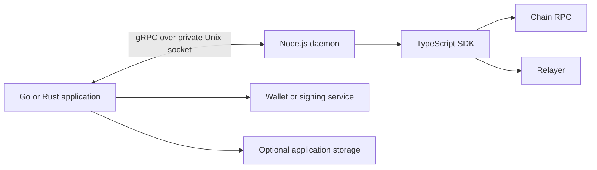

# Daemon architecture

The Go and Rust clients run SDK operations through a local Node.js daemon. The daemon runs `@zama-fhe/sdk`, which owns encryption, decryption, credentials, and protocol configuration.

## Application and daemon responsibilities

Your application creates an SDK context with a chain configuration, an optional signer, and a storage choice. An SDK context is one SDK instance running in the daemon. Close it when that configuration or signer is no longer needed.

The application retains its wallet private key or connects its own signing service. The daemon requests signatures and transaction execution through the client's signer channel. Application-owned storage uses a separate callback channel. Events arrive through an event channel.

The daemon needs outbound access to the configured RPC and relayer. Your application also needs access to dependencies it uses directly, such as a signing service or RPC for contract reads.

## Local deployment

The supported topology is one daemon per application instance, on the same host or in the same Kubernetes pod. Both processes run as the same UID and share a private Unix socket directory.

There is no network listener. A single daemon cannot serve applications across hosts or pods through the provided transport. Scaling the application means deploying another application-and-daemon pair.

Each pair serves one trust domain. SDK contexts separate configuration and lifecycle; they do not isolate untrusted tenants from each other. Read the [trust boundary](trust-boundary.md) before choosing a deployment.

## Storage and replicas

Daemon memory storage lives inside the daemon process, so it ends when its SDK context closes or the daemon exits; a volume cannot keep it. Named daemon SQLite storage is a file in the daemon's storage directory, so it survives restart when that directory is a persistent volume. Application-owned storage has the lifetime of your chosen backend.

Use a private SQLite volume for each daemon. Each named database has an exclusive daemon lock; two daemons must not share a credential volume.

Application replicas can share application-owned storage. Credential coordination stays within each daemon, so two replicas can race on the same user's credentials. This can cause extra signature requests or conflicting credential updates. Your backend must support concurrent calls.

Choose a storage backend in [Configuration](../../guides/configuration.md), then follow [Deploy in production](../operations/run-in-production.md).
