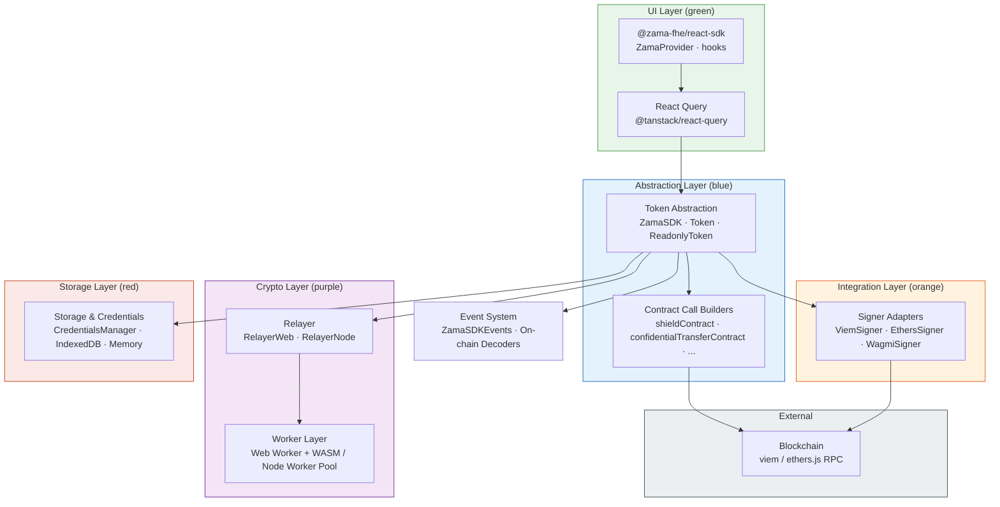
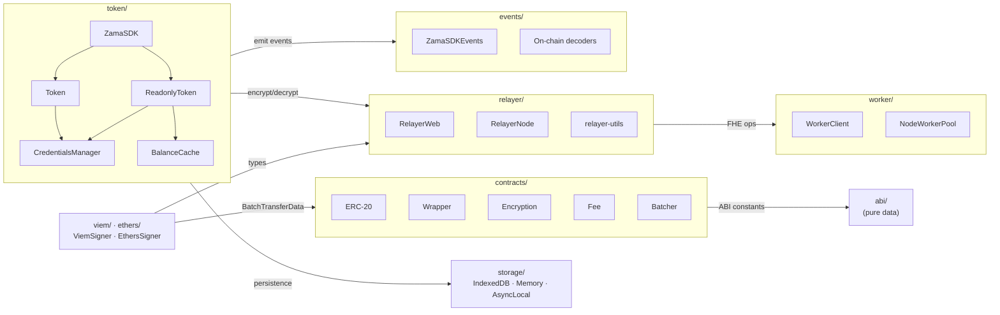
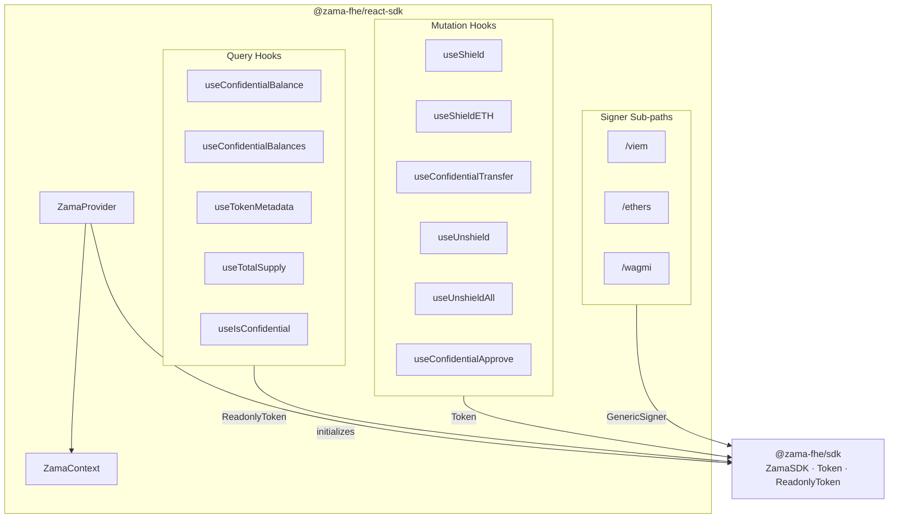

# Architecture Documentation Implementation Plan

> **For Claude:** REQUIRED SUB-SKILL: Use superpowers:executing-plans to implement this plan task-by-task.

**Goal:** Create `docs/architecture.md` with D2 and Mermaid diagrams documenting the SDK's architecture layers for internal contributors.

**Architecture:** Single markdown file with inline Mermaid diagrams and linked D2 source files. D2 files live in `docs/diagrams/` for regeneration. The document covers: overview, layer stack, core SDK modules, React SDK modules, and design patterns.

**Tech Stack:** D2 (diagram language), Mermaid (GitHub-renderable diagrams), Markdown

---

### Task 1: Create D2 layer diagram

**Files:**

- Create: `docs/diagrams/layers.d2`

**Step 1: Create the diagrams directory**

Run: `mkdir -p docs/diagrams`

**Step 2: Write the D2 layer diagram**

Create `docs/diagrams/layers.d2` with this content:

```d2
direction: down

title: {
  label: "Zama SDK Architecture Layers"
  near: top-center
  shape: text
  style.font-size: 24
  style.bold: true
}

# --- UI Layer ---
react-hooks: "@zama-fhe/react-sdk\nZamaProvider, useShield, useConfidentialBalance, ..." {
  style.fill: "#E8F5E9"
  style.stroke: "#388E3C"
  style.font-size: 14
}

react-query: "React Query\n@tanstack/react-query" {
  style.fill: "#E8F5E9"
  style.stroke: "#388E3C"
  style.font-size: 14
}

# --- Abstraction Layer ---
token: "Token Abstraction\nZamaSDK · Token · ReadonlyToken" {
  style.fill: "#E3F2FD"
  style.stroke: "#1565C0"
  style.font-size: 14
}

contracts: "Contract Call Builders\nshieldContract · confidentialTransferContract · ..." {
  style.fill: "#E3F2FD"
  style.stroke: "#1565C0"
  style.font-size: 14
}

# --- Integration Layer ---
signers: "Signer Adapters\nViemSigner · EthersSigner · WagmiSigner" {
  style.fill: "#FFF3E0"
  style.stroke: "#E65100"
  style.font-size: 14
}

# --- Crypto Layer ---
relayer: "Relayer\nRelayerWeb (browser) · RelayerNode (server)" {
  style.fill: "#F3E5F5"
  style.stroke: "#6A1B9A"
  style.font-size: 14
}

worker: "Worker Layer\nWeb Worker + WASM (browser) · Worker Pool (Node.js)" {
  style.fill: "#F3E5F5"
  style.stroke: "#6A1B9A"
  style.font-size: 14
}

# --- Storage Layer ---
storage: "Storage & Credentials\nCredentialsManager · IndexedDB · Memory · AsyncLocalStorage" {
  style.fill: "#FBE9E7"
  style.stroke: "#BF360C"
  style.font-size: 14
}

# --- External ---
blockchain: "Blockchain\nviem / ethers.js RPC · Smart Contracts" {
  style.fill: "#ECEFF1"
  style.stroke: "#37474F"
  style.font-size: 14
}

events: "Event System\nZamaSDKEvents · On-chain Event Decoders" {
  style.fill: "#FFFDE7"
  style.stroke: "#F57F17"
  style.font-size: 14
}

# --- Connections ---
react-hooks -> react-query: "query/mutation"
react-query -> token: "SDK calls"
token -> contracts: "builds tx payloads"
token -> signers: "signs & sends"
token -> relayer: "encrypt/decrypt"
token -> events: "emits lifecycle events"
contracts -> blockchain: "ABI-encoded calls"
signers -> blockchain: "RPC + signing"
relayer -> worker: "delegates FHE ops"
token -> storage: "credential persistence"
```

**Step 3: Commit**

```bash
git add docs/diagrams/layers.d2
git commit -m "docs: add D2 architecture layer diagram"
```

---

### Task 2: Create D2 core SDK module map

**Files:**

- Create: `docs/diagrams/sdk-modules.d2`

**Step 1: Write the D2 module map**

Create `docs/diagrams/sdk-modules.d2` with this content:

```d2
direction: right

title: {
  label: "@zama-fhe/sdk Module Map"
  near: top-center
  shape: text
  style.font-size: 24
  style.bold: true
}

# --- Modules ---
token: "token/" {
  zama-sdk: "ZamaSDK\n(factory)"
  tok: "Token\n(write ops)"
  readonly: "ReadonlyToken\n(read ops)"
  creds: "CredentialsManager"
  cache: "BalanceCache"

  zama-sdk -> tok: creates
  zama-sdk -> readonly: creates
  tok -> creds: loads credentials
  readonly -> creds: loads credentials
  readonly -> cache: caches balances
}

contracts: "contracts/" {
  erc20: "ERC-20 builders"
  wrapper: "Wrapper builders"
  encryption: "Encryption builders"
  fee: "Fee builders"
  batcher: "Transfer batcher"
}

relayer: "relayer/" {
  web: "RelayerWeb\n(browser)"
  node: "RelayerNode\n(server)"
  utils: "relayer-utils"
}

worker: "worker/" {
  browser: "WorkerClient\n(Web Worker + WASM)"
  nodepool: "NodeWorkerPool\n(worker_threads)"
}

events: "events/" {
  sdk-events: "ZamaSDKEvents"
  onchain: "On-chain decoders"
}

abi: "abi/" {
  label: "ABI definitions\n(pure data)"
  style.fill: "#ECEFF1"
}

storage: "storage/" {
  indexeddb: "IndexedDBStorage"
  memory: "MemoryStorage"
  async-local: "AsyncLocalStorage"
}

signers: "viem/ · ethers/" {
  viem-signer: "ViemSigner"
  ethers-signer: "EthersSigner"
}

# --- Dependencies ---
token -> relayer: "encrypt/decrypt"
token -> events: "emit events"
contracts -> abi: "ABI constants"
relayer -> worker: "FHE operations"
signers -> relayer: "Address/Hex types"
signers -> contracts: "BatchTransferData"
token -> storage: "credential persistence"
```

**Step 2: Commit**

```bash
git add docs/diagrams/sdk-modules.d2
git commit -m "docs: add D2 core SDK module map diagram"
```

---

### Task 3: Write the architecture document

**Files:**

- Create: `docs/architecture.md`

**Step 1: Write `docs/architecture.md`**

````markdown
# SDK Architecture

The Zama SDK provides confidential ERC-20 token operations using Fully Homomorphic Encryption (FHE). It hides FHE complexity behind a familiar token API — shield, transfer, unshield — with swappable signer adapters, pluggable storage backends, and browser/server support via Web Workers and WASM.

## Architecture Layers

> D2 source: [`docs/diagrams/layers.d2`](diagrams/layers.d2)


````

### UI Layer

`@zama-fhe/react-sdk` provides React hooks wrapping every SDK operation. `ZamaProvider` initializes the SDK and sets up React Query for caching and deduplication. Query hooks (`useConfidentialBalance`, `useTokenMetadata`) handle read operations; mutation hooks (`useShield`, `useConfidentialTransfer`, `useUnshield`) handle writes.

**Key files:** `packages/react-sdk/src/provider.tsx`, `packages/react-sdk/src/token/`

### Token Abstraction

`ZamaSDK` is the entry point — a factory that creates `Token` (write operations) and `ReadonlyToken` (read operations) instances. `Token` provides the ERC-20-like API: `shield()`, `transfer()`, `unshield()`. `ReadonlyToken` handles `balanceOf()`, `allowance()`, and metadata queries.

**Key files:** `packages/sdk/src/token/zama-sdk.ts`, `packages/sdk/src/token/token.ts`, `packages/sdk/src/token/readonly-token.ts`

### Contract Call Builders

Pure functions that construct transaction payloads for each contract interaction. Each builder takes parameters and returns a `ContractCallConfig` that signers can execute. Organized by concern: ERC-20 (`approve`, `balanceOf`), Wrapper (`shield`, `unwrap`), Encryption (`confidentialTransfer`, `confidentialBalanceOf`), Fees, Batching.

**Key files:** `packages/sdk/src/contracts/`

### Signer Adapters

`GenericSigner` is the trait that all signer adapters implement. Each adapter translates SDK operations into library-specific calls: `ViemSigner` wraps viem's `walletClient`, `EthersSigner` wraps ethers.js `Signer`, `WagmiSigner` (in react-sdk) wraps wagmi hooks. Adapters handle `writeContract()`, `signTypedData()` (EIP-712), and `readContract()`.

**Key files:** `packages/sdk/src/viem/viem-signer.ts`, `packages/sdk/src/ethers/ethers-signer.ts`, `packages/react-sdk/src/wagmi/`

### Relayer

`RelayerWeb` (browser) and `RelayerNode` (server) manage FHE operations: keypair generation, encryption, and decryption. They delegate computation to the Worker layer and handle chain switching. `RelayerWeb` uses a Promise Lock to serialize concurrent operations during worker initialization.

**Key files:** `packages/sdk/src/relayer/relayer-web.ts`, `packages/sdk/src/relayer/relayer-node.ts`

### Worker Layer

Browser: a Web Worker running `@zama-fhe/relayer-sdk` WASM for FHE computation, communicating via RPC messages. Node.js: `RelayerNodePool` manages a pool of `worker_threads` for concurrent crypto operations.

**Key files:** `packages/sdk/src/worker/worker.client.ts`, `packages/sdk/src/worker/relayer-sdk.worker.ts`, `packages/sdk/src/worker/worker.node-pool.ts`

### Storage & Credentials

`CredentialsManager` handles the FHE keypair lifecycle: generate, encrypt (AES-GCM with key derived from wallet signature via PBKDF2), store, reload, and refresh on expiry. Storage backends are swappable: `IndexedDBStorage` for browser persistence, `MemoryStorage` for tests, `AsyncLocalStorage` for Node.js.

**Key files:** `packages/sdk/src/token/credential-manager.ts`, `packages/sdk/src/token/balance-cache.ts`

### Event System

`ZamaSDKEvents` emits structured lifecycle events (credentials loading/cached/expired, encrypt/decrypt start/end/error, transaction submitted). On-chain event decoders parse `Transfer`, `Wrapped`, `UnwrapRequested` logs. The event system is mostly standalone — only depends on `Address`/`Hex` types from the relayer module.

**Key files:** `packages/sdk/src/events/sdk-events.ts`, `packages/sdk/src/events/onchain-events.ts`

---

## Core SDK Module Map

> D2 source: [`docs/diagrams/sdk-modules.d2`](diagrams/sdk-modules.d2)



**Dependency direction is acyclic.** `abi/` is fully standalone (pure data). `events/` is mostly standalone. `worker/` sits at the bottom of the crypto stack. `token/` is the orchestrator that connects all layers.

---

## React SDK Module Map



`ZamaProvider` creates and holds the `ZamaSDK` instance. Query hooks call `ReadonlyToken` methods. Mutation hooks call `Token` methods. Each signer sub-path (`/viem`, `/ethers`, `/wagmi`) re-exports hooks pre-bound to the appropriate signer adapter.

---

## Key Design Patterns

| Pattern                | Where                                   | Why                                                                               |
| ---------------------- | --------------------------------------- | --------------------------------------------------------------------------------- |
| **Factory**            | `ZamaSDK` → `Token`/`ReadonlyToken`     | Centralizes construction, injects relayer + signer + storage consistently         |
| **Adapter**            | `GenericSigner`, `GenericStringStorage` | Swappable wallet libraries and storage backends without changing core logic       |
| **Worker Pool**        | `RelayerNodePool`                       | Distributes CPU-intensive FHE operations across Node.js worker threads            |
| **Promise Lock**       | `RelayerWeb.#ensureLock`                | Serializes concurrent operations during worker init and chain switching           |
| **Observer**           | `ZamaSDKEvents`                         | Streams lifecycle events for observability without coupling to specific telemetry |
| **Cache + Encryption** | `CredentialsManager`                    | AES-GCM encrypts private keys at rest; session cache avoids re-derivation         |

````

**Step 2: Commit**

```bash
git add docs/architecture.md
git commit -m "docs: add architecture document with layer and module diagrams"
````

---

### Task 4: Verify diagrams render correctly

**Step 1: Check Mermaid syntax**

Run: `npx -y @mermaid-js/mermaid-cli mmdc -i docs/architecture.md -o /tmp/mermaid-check.md 2>&1 || echo "mermaid-cli not critical, check manually"`

If mermaid-cli isn't available, open `docs/architecture.md` in GitHub preview or VS Code with Mermaid extension to verify the 3 Mermaid diagrams render.

**Step 2: Check D2 syntax**

Run: `which d2 && d2 docs/diagrams/layers.d2 /tmp/layers.svg && d2 docs/diagrams/sdk-modules.d2 /tmp/sdk-modules.svg && echo "D2 renders OK" || echo "d2 not installed, verify manually"`

If d2 is not installed, the `.d2` files can be verified at https://play.d2lang.com by pasting the content.

**Step 3: Final commit if any fixes needed**

```bash
git add -A docs/
git commit -m "docs: fix diagram syntax issues"
```
