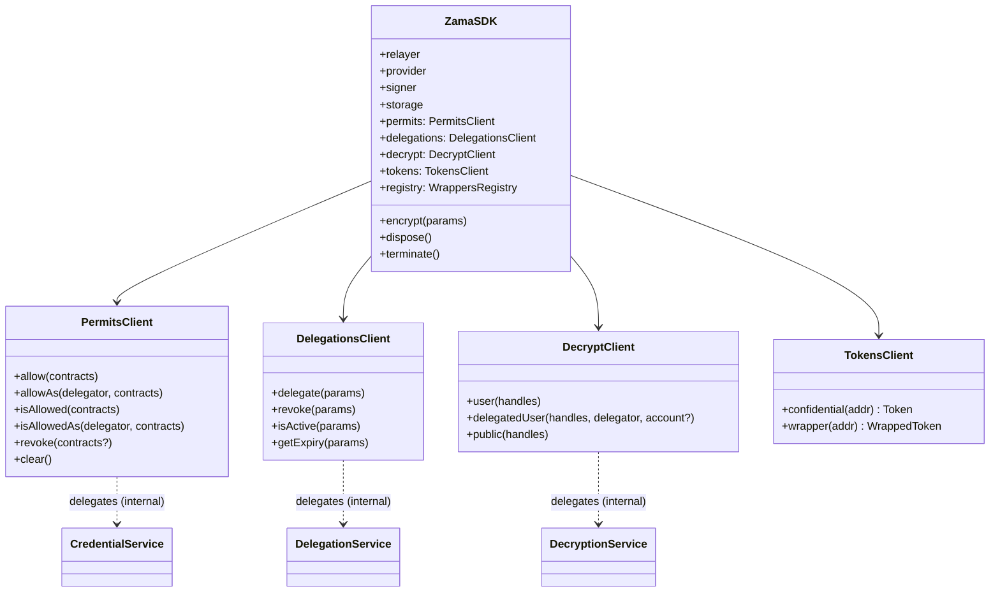
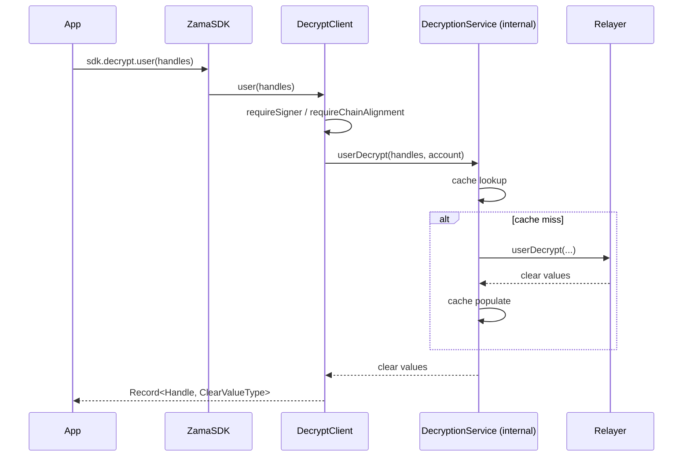

# Restructure `ZamaSDK` into Domain Sub-Clients

> **Update (2026-05-15):** This spec describes the original SDK-169 four-sub-client carve. The shape was further refined before v3 graduated from alpha — `sdk.tokens` was dropped in favour of root `sdk.createToken` / `sdk.createWrappedToken`, permits methods were renamed (grantPermit/hasPermit/grantDelegationPermit/hasDelegationPermit/revokePermits), and `sdk.decrypt.delegatedUser` became `sdk.decrypt.delegated`. The historical context below is preserved for reference, but the current public API is the post-refinement shape.

**Status:** Superseded by post-alpha refinement (May 2026)
**Target release:** `3.0.0-alpha.38`
**Affected packages:** `@zama-fhe/sdk`, `@zama-fhe/react-sdk`, `examples/**`, `docs/gitbook/src/**`

---

## Summary

Carve the flat `ZamaSDK` surface into four domain sub-clients — `permits`, `delegations`, `decrypt`, `tokens` — exposed as readonly properties, so the public API matches the internal service boundaries and stops accreting unrelated methods as the SDK grows.

---

## Motivation

### Context

`ZamaSDK` is the entry point of `@zama-fhe/sdk`. Today it exposes roughly fourteen domain methods at the top level — `allow`, `allowAs`, `isAllowed`, `isAllowedAs`, `revokePermits`, `clearCredentials`, `delegateDecryption`, `revokeDelegation`, `isDelegated`, `getDelegationExpiry`, `userDecrypt`, `delegatedUserDecrypt`, `publicDecrypt`, `encrypt` — alongside two token factories (`createToken`, `createWrappedToken`), one read-only sub-namespace (`registry`), and lifecycle methods (`dispose`, `terminate`, `[Symbol.dispose]`). Internally, this surface is already organised behind four service classes — `CredentialService`, `DelegationService`, `DecryptionService`, `EncryptionService` — but the public class flattens them all.

### Problem

Integrators see a single autocomplete list of fourteen verbs spanning four unrelated domains. There is no signal in the surface that `allow` and `revokePermits` belong together (both manage off-chain signed permits), that `delegateDecryption` and `isDelegated` are a different family (on-chain ACL writes with cross-chain propagation), or that `userDecrypt` / `delegatedUserDecrypt` / `publicDecrypt` form a third coherent family (relayer round-trips for decryption). Method-name stuttering compensates — every method re-encodes its domain in its name — but the surface still reads as one long list.

The surface is also about to grow. Batch decrypt variants are already landing as `@internal` (see `delegatedBatchDecryptHandlesAs`). Additional delegation primitives are planned. Every new method added at the top level deepens the god-class shape and widens the gap between the public API and the internal service boundaries that already exist.

### Impact

For integrators, the cost is discoverability: there is no IDE-assisted path from "I want to manage permits" to the right four methods, because all fourteen present as peers. For maintainers, the cost is invariant drift: SDK-level guards (chain alignment, empty-array short-circuits, event emission, decrypt-cache invalidation) are repeated across `ZamaSDK` methods rather than living in a single place per domain, and the public surface no longer honestly reflects the internal architecture.

---

## Proposal

Restructure `ZamaSDK` so each internal service has a corresponding public sub-client exposed as a readonly property. `sdk.permits` owns permit and keypair management; `sdk.delegations` owns on-chain ACL writes; `sdk.decrypt` owns the three decryption flavours; `sdk.tokens` becomes the typed factory for `Token` and `WrappedToken`. The existing `sdk.registry` stays where it is. Top-level domain methods are removed.

Each sub-client is a new thin public class — `PermitsClient`, `DelegationsClient`, `DecryptClient`, `TokensClient` — that owns the SDK-level guards currently scattered through `ZamaSDK` and delegates the actual work to the existing internal `*Service` classes, which remain `@internal`. Sub-clients are instantiated eagerly in the `ZamaSDK` constructor and are always present, even when no signer is configured; signer-required methods throw `SignerNotConfiguredError` at call time, matching today's behaviour exactly.

The restructure stops at `ZamaSDK`. `Token` and `WrappedToken` keep their flat method surfaces because they are a single coherent domain object that intentionally mirrors ERC-20 — nesting their methods would break the "clear-text in, clear-text out" mental model. The `@zama-fhe/react-sdk` hooks keep their flat names (`useAllow`, `useUserDecrypt`, `useDelegateDecryption`, `useToken`, …) and only reroute their internal `sdk.*` calls — React consumers see no public breakage.

### Before / After

```ts
// Before
await sdk.allow([cUSDT]);
const values = await sdk.userDecrypt([{ handle, contractAddress: cUSDT }]);
const token = sdk.createWrappedToken(cUSDT);
await sdk.delegateDecryption({ contractAddress: cUSDT, delegateAddress });

// After
await sdk.permits.allow([cUSDT]);
const values = await sdk.decrypt.user([{ handle, contractAddress: cUSDT }]);
const token = sdk.tokens.wrapper(cUSDT);
await sdk.delegations.delegate({ contractAddress: cUSDT, delegateAddress });
```

### Sub-client shape (architecture view)



---

## Detailed Design

### Naming map

The full before/after table is the source of truth for the rename. Each row is a mechanical change to a single call site.

| Before                               | After                                 |
| ------------------------------------ | ------------------------------------- |
| `sdk.allow(c)`                       | `sdk.permits.allow(c)`                |
| `sdk.allowAs(d, c)`                  | `sdk.permits.allowAs(d, c)`           |
| `sdk.isAllowed(c)`                   | `sdk.permits.isAllowed(c)`            |
| `sdk.isAllowedAs(d, c)`              | `sdk.permits.isAllowedAs(d, c)`       |
| `sdk.revokePermits(c?)`              | `sdk.permits.revoke(c?)`              |
| `sdk.clearCredentials()`             | `sdk.permits.clear()`                 |
| `sdk.delegateDecryption({...})`      | `sdk.delegations.delegate({...})`     |
| `sdk.revokeDelegation({...})`        | `sdk.delegations.revoke({...})`       |
| `sdk.isDelegated({...})`             | `sdk.delegations.isActive({...})`     |
| `sdk.getDelegationExpiry({...})`     | `sdk.delegations.getExpiry({...})`    |
| `sdk.userDecrypt(h)`                 | `sdk.decrypt.user(h)`                 |
| `sdk.delegatedUserDecrypt(h, d, a?)` | `sdk.decrypt.delegatedUser(h, d, a?)` |
| `sdk.publicDecrypt(h)`               | `sdk.decrypt.public(h)`               |
| `sdk.encrypt(p)`                     | `sdk.encrypt(p)` _(unchanged)_        |
| `sdk.createToken(a)`                 | `sdk.tokens.confidential(a)`          |
| `sdk.createWrappedToken(a)`          | `sdk.tokens.wrapper(a)`               |
| `sdk.registry`                       | `sdk.registry` _(unchanged)_          |

Two naming choices warrant explicit justification.

**`permits` rather than `credentials`.** The user-facing concept is permits — five of the six methods (`allow`, `allowAs`, `isAllowed`, `isAllowedAs`, `revoke`) directly manage the signed-permit store. The FHE keypair is invisible plumbing: there is no `getKeypair()` or `regenerateKeypair()` surfaced; the keypair exists to sign permits and is recreated automatically when needed. `sdk.permits` matches the mental model integrators bring (`"I want to authorize this contract"` → `"sdk.permits.allow"`). It also kills the `revokePermits` stutter cleanly — once the namespace is named, the method becomes `revoke()`. The remaining wrinkle is `clear()`: it wipes both the permit store and the keypair (the keypair is the load-bearing thing, since permits cascade-delete with it). This is documented on the method — a "permits reset" implies a clean slate including the keypair that signs them, which is what users want when they ask for a reset.

**`isActive` rather than `isDelegated`.** Inside `sdk.delegations`, the method name should not re-encode the domain. `sdk.delegations.isDelegated({...})` stutters; `sdk.delegations.isActive({...})` reads as a predicate on the namespace. This is the one rename in the table that changes semantic surface rather than just structure.

### Sub-client responsibilities

Each `*Client` class encapsulates the SDK-level guards that currently live inside `ZamaSDK` methods. The internal `*Service` classes are unchanged; they do the work.

**`PermitsClient`** wraps `CredentialService`. It is responsible for the empty-array short-circuit on `allow` and `allowAs` (returning without calling the service), for `requireChainAlignment` checks on every write, for `#requireCredentialService` enforcement (throwing `SignerNotConfiguredError` when no signer), and for clearing the decrypt cache for the signer's address after `revoke` and `clear`. The two read predicates `isAllowed` and `isAllowedAs` return `false` when no signer is configured rather than throwing, matching today's behaviour.

**`DelegationsClient`** wraps `DelegationService`. It owns the signer requirement and chain-alignment checks on `delegate` and `revoke`, and resolves the `delegatorAddress` from the wallet account so callers do not pass it explicitly. The two read methods `isActive` and `getExpiry` are signer-independent.

**`DecryptClient`** wraps `DecryptionService` for `user` and `delegatedUser`, and calls `relayer.publicDecrypt` directly for `public` (matching today's `ZamaSDK.publicDecrypt`). It is responsible for the empty-array short-circuit on `public`, for `wrapDecryptError` around the relayer call, and for the signer-required guards on `user` and `delegatedUser`. The mixed signer requirement within one namespace is accepted and documented in JSDoc on each method.

**`TokensClient`** is a pure factory. `confidential(addr)` returns a new `Token` bound to the SDK; `wrapper(addr)` returns a new `WrappedToken`. No guards are needed because instantiation is signer-independent and reads no on-chain state. Subsequent calls with the same address return new instances; there is no caching at this layer (matches today).

### `ZamaSDK` after slim-down

The constructor wires the four sub-clients eagerly. The public surface keeps the wired-in primitives (`relayer`, `provider`, `signer`, `storage`), the four sub-client properties, `registry`, the unchanged `encrypt(params)` top-level method, and the lifecycle trio (`dispose`, `terminate`, `[Symbol.dispose]`). Internal helpers (`onWalletAccountChange`, `emitEvent`, `requireSigner`, `createWrappersRegistry`) remain `@internal`.

The fourteen flat domain methods are deleted outright — no `@deprecated` aliases, no forwarders. See [Risks and Mitigations](#risks-and-mitigations) for why aliasing during alpha is the wrong trade-off.

### Decryption flow (no behaviour change, only surface change)

The actual wire-level behaviour of every method is unchanged. The diagram below shows that the only thing moving is the public entry point — guards, services, relayer round-trip, and cache logic are identical.



### No-signer handling

Today, `ZamaSDK.allow()` throws `SignerNotConfiguredError("allow")` when no signer is configured. After the restructure, `sdk.permits.allow()` throws the same error with the same operation tag. The two read methods `sdk.permits.isAllowed()` and `sdk.permits.isAllowedAs()` continue to return `false` rather than throw.

The asymmetric `DecryptClient` (where `user` / `delegatedUser` need a signer and `public` does not) is the only client with mixed requirements. This matches today's `sdk.publicDecrypt()` working without a signer while `sdk.userDecrypt()` throws. The asymmetry is documented in JSDoc on each method; no structural workaround is applied.

### Type exports

`packages/sdk/src/index.ts` adds four `export type` lines for `PermitsClient`, `DelegationsClient`, `DecryptClient`, `TokensClient`. The internal `*Service` classes remain unexported. Consumers can annotate function parameters and return types against the public client types.

### React SDK changes

Hook _names_ and signatures are unchanged. The internal `sdk.*` calls reroute: `useAllow` calls `sdk.permits.allow()` instead of `sdk.allow()`; `useUserDecrypt` calls `sdk.decrypt.user()` instead of `sdk.userDecrypt()`; `useToken(addr)` calls `sdk.tokens.confidential(addr)` instead of `sdk.createToken(addr)`; and so on across the hook surface. No React consumer call site changes.

### Migration scope (single PR)

The entire restructure ships as one PR:

- `packages/sdk/src/zama-sdk.ts` — slim down; remove the fourteen flat domain methods; wire the four sub-clients.
- `packages/sdk/src/clients/` _(new directory)_ — `permits-client.ts`, `delegations-client.ts`, `decrypt-client.ts`, `tokens-client.ts`.
- `packages/sdk/src/index.ts` — add type exports for the four clients.
- `packages/sdk/src/services/**` — unchanged.
- `packages/react-sdk/src/**` — update hook internals; no public surface change.
- `examples/**` — update every call site to the new shape.
- `docs/gitbook/src/**` — update every snippet to the new shape.
- `CHANGELOG.md` — single entry containing the rename table.

---

## Specification Changes

- **`docs/agents/architecture.md`** — Update the description of `ZamaSDK`'s public surface to reference the four sub-clients and the slim top-level method set.
- **`docs/agents/conventions.md`** — Add a convention entry: domain operations live on sub-clients; the `ZamaSDK` class itself holds only primitives, the single-verb `encrypt`, lifecycle, and the four sub-client properties.
- **`docs/gitbook/src/guides/*.md`** — Update every code snippet that calls a flat method on `ZamaSDK`; the routing-table doc for shielding does not change because `WrappedToken.shield` is the documented entry point.
- **`docs/gitbook/src/api/*.md`** _(if present)_ — Replace flat-method API references with sub-client references.
- **`CHANGELOG.md`** — Add a `3.0.0-alpha.38` entry containing the full rename table.

---

## Testing Decisions

Tests target external behaviour only — what does the client do when called with this input, what error does it throw under this condition. They do not assert that a specific internal service method was called with specific positional arguments; those are implementation details that would have to change every time the internal services are refactored.

All four `*Client` classes get unit tests.

**`PermitsClient` tests** cover: `SignerNotConfiguredError` on every write when no signer is configured; empty-array short-circuit on `allow` and `allowAs` (no service call, no error); `ChainMismatchError` when signer and provider are on different chains; `isAllowed` and `isAllowedAs` returning `false` (not throwing) when no signer is configured; delegator parameter routing for `allowAs` and `isAllowedAs`; decrypt-cache invalidation after `revoke` and `clear`.

**`DelegationsClient` tests** cover: `SignerNotConfiguredError` on `delegate` and `revoke` when no signer is configured; chain-mismatch detection on writes; correct delegator address resolution from the wallet account; `isActive` and `getExpiry` working without a signer.

**`DecryptClient` tests** cover: `SignerNotConfiguredError` on `user` and `delegatedUser` when no signer is configured; `public` working without a signer; empty-array short-circuit on `public` returning the zero-result shape (`{ clearValues: {}, decryptionProof: "0x", abiEncodedClearValues: "0x" }`); relayer errors wrapped through `wrapDecryptError` on `public`; cache behaviour preserved end-to-end for `user` and `delegatedUser`.

**`TokensClient` tests** cover: `confidential(addr)` returns a `Token` bound to the SDK; `wrapper(addr)` returns a `WrappedToken` bound to the SDK; repeated calls with the same address return distinct instances.

Prior art for the mock-service test scaffolding lives in `packages/sdk/src/services/__tests__/credential-service.test.ts`, `delegation-service.test.ts`, and `decryption-service.test.ts`. Prior art for SDK-level guard testing patterns (signer mocks, chain-mismatch fixtures) lives in `packages/sdk/src/__tests__/zama-sdk.*.test.ts`.

Existing integration tests in `examples/` and end-to-end suites exercise the full flow. After their call sites are updated in this PR, they validate the new shape end-to-end; no new integration tests are required.

---

## Non-Goals

This RFC does not address:

- **Restructuring `Token` / `WrappedToken`.** Their flat method surfaces remain. ERC-20 is flat by design; nesting these methods would fracture the "clear-text in, clear-text out" mental model. Method count is high but responsibility is singular.
- **Renaming React hooks.** `useAllow`, `useUserDecrypt`, `useDelegateDecryption`, `useToken`, and the rest keep their names. Only their internal `sdk.*` calls reroute.
- **Backwards-compatibility aliases.** No `@deprecated` flat methods remain on `ZamaSDK`. Alpha consumers migrate at the alpha boundary.
- **Renaming or relocating `sdk.registry`.** It stays at the root with its existing API.
- **Splitting `sdk.decrypt.public` out of `sdk.decrypt`.** The mixed signer requirement within one namespace is accepted as the lesser cost vs. cosmetic purity.
- **Restructuring `RelayerSDK` / `RelayerDispatcher`.** Those are wired-in primitives, not domain operations.
- **Renaming internal `*Service` classes.** They remain `@internal` with their current names.
- **Lazy / getter-based sub-client construction.** Eager construction in the constructor is final; service instantiation is cheap and lazy getters complicate the type for no measurable gain.

---

## Alternatives Considered

### Alternative: Keep the flat surface, add new methods at the top level

Continue adding methods directly to `ZamaSDK` as new functionality lands. No restructure.

**Why not chosen:** the surface is already at fourteen domain methods spanning four unrelated families, and growth is imminent — batch decrypt variants are already landing as `@internal`. Continuing on this trajectory turns the god-class smell into a fact. The cost of restructuring grows with every method added; doing it now is cheaper than doing it later.

### Alternative: Deprecate-and-keep flat methods for the rest of the 3.0 alpha cycle

Retain the flat methods as `@deprecated` thin forwarders to the new sub-clients. Remove before 3.0 stable.

**Why not chosen:** alpha is precisely the window for breakage; that is what alpha means. Deprecation aliases during alpha produce the worst-of-both — they double the API surface to learn while the shape is still moving, and no consumer acts on deprecation warnings during alpha. A clean break at `3.0.0-alpha.38` with a CHANGELOG rename table is mechanically cheaper for both maintainers and integrators.

### Alternative: Merge `permits` and `delegations` into a single `sdk.acl` client

Both are ACL-related from the user's point of view ("who can decrypt what"). Combine them under one namespace.

**Why not chosen:** the two have very different semantics. Permits are off-chain EIP-712-signed keypair scopes stored locally; delegations are on-chain `ACL.delegateForUserDecryption()` writes with cross-chain propagation latency (the one-to-two-minute gateway sync gap documented in the JSDoc on `delegateDecryption`). Merging them buries the distinction integrators most need to understand. Two clients keeps the boundary visible.

### Alternative: Pair `encrypt` and `decrypt` under one `sdk.cipher` namespace

Put `encrypt` next to the decrypt family for symmetry.

**Why not chosen:** `encrypt` is a single verb, while `decrypt` is a family of three. The pairing would produce `sdk.cipher.encrypt(...)` next to `sdk.cipher.decrypt.user(...)` — two levels of namespacing for one verb. A one-method namespace is a worse god-class shape than a flat top-level method, because it lies about being a domain. If batch / streaming encrypt variants land later, `encrypt` can be promoted into its own namespace then.

### Alternative: Nest `Token` / `WrappedToken` methods too

Apply the same restructure to `Token` (`token.balance.get(owner)`, `token.transfer.confidential(...)`, …).

**Why not chosen:** `ZamaSDK` mixed four unrelated domains, which is the actual god-class smell. `Token` does one thing — be the ERC-7984 surface — and many methods is fine for a single coherent domain object. Nesting `Token` methods would break the ERC-20 analogy that "clear-text in, clear-text out" rests on. Method count alone does not make a god class; mixed responsibility does.

### Alternative: Lazy getters for sub-clients (matching the Dfns example literally)

Use `get permits(): PermitsClient` accessors that lazily instantiate on first access.

**Why not chosen:** lazy getters buy nothing here. Service instantiation is cheap (object construction with already-allocated dependencies). Lazy getters complicate the types and produce subtle differences between the first access and subsequent accesses. Eager construction in the constructor is simpler and produces identical user-facing behaviour.

---

## Security Considerations

The restructure changes no security-relevant behaviour. Permits, delegations, encryption, and decryption all run through the same internal services with the same arguments. SDK-level guards (chain alignment, signer requirement, empty-array short-circuit) are preserved verbatim — they move from `ZamaSDK` methods into the corresponding `*Client` classes, but their logic and the errors they throw are unchanged. The relayer wire protocol, EIP-712 payload shapes, on-chain calldata, and ACL semantics are untouched.

The threat model is unchanged. No new attack surface is introduced; no trust boundary moves.

No formal security review is required for this RFC.

---

## Risks and Mitigations

| Risk                                                                                                 | Likelihood | Impact | Mitigation                                                                                                                                                                                            |
| ---------------------------------------------------------------------------------------------------- | ---------- | ------ | ----------------------------------------------------------------------------------------------------------------------------------------------------------------------------------------------------- |
| Alpha consumers integrate the old shape between PR open and merge                                    | Medium     | Low    | CHANGELOG rename table is mechanical; migration is one find-and-replace per row. Coordinate the merge with a brief note in the team channel.                                                          |
| Hook internal reroute drifts from SDK rename (hook still calls `sdk.allow` after `allow` is deleted) | Medium     | High   | TypeScript catches this at build time — every removed method becomes a compile error at the hook call site in the same PR. CI must be green before merge.                                             |
| Example app missed in the rename                                                                     | Medium     | Medium | TypeScript catches this at build time in the affected example's build step. CI builds all example apps; a missed call site fails CI in the same PR.                                                   |
| Docs snippets in GitBook drift from the new shape                                                    | High       | Low    | Snippets are checked into `docs/gitbook/src/**`; the same PR updates them all. Drift is bounded to docs added after this PR lands, mitigated by the convention entry in `docs/agents/conventions.md`. |
| Integrators read the rename table and miss the `isDelegated` → `isActive` semantic shift             | Low        | Low    | Highlight this rename explicitly in the CHANGELOG entry as the one row that is more than a structural move.                                                                                           |
| `sdk.decrypt.public` callers without a signer get confused by errors from sibling methods            | Low        | Low    | Document the mixed signer requirement explicitly in `DecryptClient` JSDoc on each method; the runtime error message is unchanged and includes the operation name.                                     |

---

## Further Notes

The restructure follows the internal service boundaries that already exist (`CredentialService`, `DelegationService`, `DecryptionService`, `EncryptionService`). The public surface is being brought in line with the internal architecture, not redesigned from scratch.

The two-level depth (`sdk.decrypt.user`, `sdk.tokens.confidential`) is the maximum any path reaches. No proposal goes three deep; `sdk.tokens.registry.getTokenPairs()` was considered and rejected in favour of leaving `sdk.registry` at the root.

Migration cost is concentrated: one PR, mechanical renames, every in-tree call site updated together. There is no half-state where the SDK exposes both shapes.
